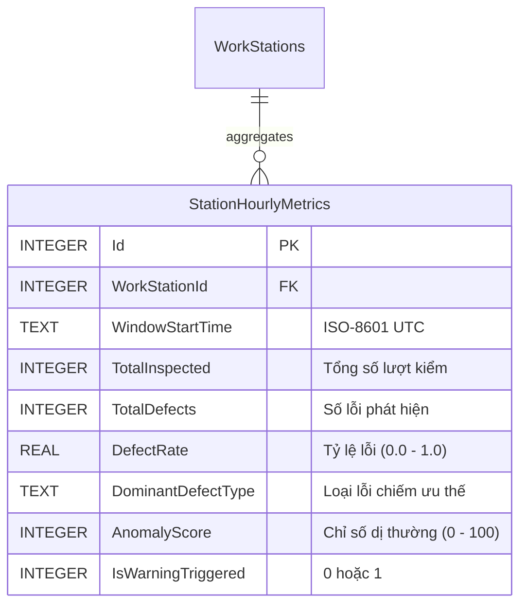

# KCS-SmartFactory OS — Đề Án Kiến Trúc: Chiến Lược Mở Rộng & Tối Ưu Hóa AI (AI Capabilities Roadmap)

**Mã tài liệu:** `STRAT-AI-ROADMAP-2026`  
**Phiên bản:** `1.0.0` (Architectural Blueprint)  
**Tác giả:** `[📐 PLAN]` — Principal System Architect & Enterprise Technical Director  
**Trình bày tới:** `[👑 LEADER]` — Chief Project Director  
**Công nghệ:** `.NET 10`, `Google Gemini 1.5 Flash Vision / Embedding`, `QuestPDF`, `SignalR Core`, `SQLite Vector / Vectorized Cosine Similarity`  
**Tiêu chuẩn liên quan:** `ISO 9001:2015 Clause 9.1.3 (Analysis and Evaluation)`, `Clause 10.2 (Nonconformity and Corrective Action)`

---

## 1. Bối Cảnh & Tầm Nhìn Chiến Lược (Strategic Context)

KCS-SmartFactory OS đã hoàn thành xuất sắc giai đoạn nền tảng:
- ✅ Phân tích nhận diện ảnh khuyết tật hiện trường với **Google Gemini 1.5 Flash Vision**.
- ✅ Cơ chế **Smart Heuristic Fallback** chống sập 100% khi mất mạng hoặc timeout.
- ✅ Khóa lô hàng nguyên tử (**Atomic Lot Locking**) và cảnh báo **SignalR Realtime Andon**.
- ✅ Xuất biên bản sự cố chuẩn quốc tế **ISO 9001:2015 PDF** với thư viện **QuestPDF**.

Để nâng tầm hệ thống từ một công cụ **"Ghi nhận sự cố bị động (Reactive NCR)"** thành một hệ điều hành **"Dự báo chất lượng chủ động & Tự động hóa tri thức (Proactive & Cognitive Quality OS)"**, kiến trúc AI cần được mở rộng theo 3 trục chiến lược:

```
                          [ KCS-SMARTFACTORY OS: AI EXPANSION TRIAD ]
                                              │
         ┌────────────────────────────────────┼────────────────────────────────────┐
         ▼                                    ▼                                    ▼
   [ TRỤC 1: SPRINT 3 ]                 [ TRỤC 2: SPRINT 4 ]                 [ TRỤC 3: SPRINT 5 ]
  AI Automated 5-Why &                AI Predictive Quality &              AI CAPA Knowledge Base &
Ishikawa Fishbone Generator             Anomaly Detection                  RAG Recommendation Engine
(Tự động hóa phân tích sâu)           (Cảnh báo sớm khuyết tật)             (Truy vấn tri thức quá khứ)
         │                                    │                                    │
         ▼                                    ▼                                    ▼
 • 5 tầng nguyên nhân Why 1..5        • Chuỗi thời gian (Time-series)      • Vector Embedding 768 dims
 • Ma trận 6M (Man, Machine...)       • Thống kê SPC (EWMA / Drift)        • SQLite Vector Cosine Sim
 • Nhúng trực quan vào PDF ISO        • Cảnh báo SignalR tiền khóa lô      • Tự gợi ý giải pháp CAPA
```

---

## 2. Chi Tiết Đề Án 3 Hướng Nâng Cấp AI

---

### TRỤC 1: AI Automated 5-Why & Ishikawa Fishbone Generator (Sprint 3)

#### 2.1 Bản chất nghiệp vụ & Mục tiêu
Trong quy trình ISO 9001:2015 Clause 10.2, biên bản sự cố bắt buộc phải chứng minh hành động tìm hiểu nguyên nhân gốc rễ thông qua hai công cụ chất lượng kinh điển:
1. **5-Why Analysis:** Đặt câu hỏi "Tại sao" liên tiếp 5 lần để đào sâu từ hiện tượng bề mặt đến lỗi hệ thống/con người/quy trình.
2. **Ishikawa Diagram (Biểu đồ xương cá 6M):** Phân bổ nguyên nhân vào 6 yếu tố: Con người (*Man*), Máy móc (*Machine*), Vật liệu (*Material*), Phương pháp (*Method*), Đo lường (*Measurement*), Môi trường (*Milieu/Environment*).

Việc bắt nhân viên KCS hoặc Quản đốc gõ tay sơ đồ này thường mất từ 30 đến 45 phút, dẫn đến xu hướng làm đối phó, ghi sơ sài. AI Generator giải quyết triệt để vấn đề này trong **< 2 giây**.

#### 2.2 Luồng dữ liệu kỹ thuật (Architectural Flow)
```
[ KCS gửi ảnh + Mô tả hiện trường ]
                │
                ▼
[ AiInspectionService.GenerateRootCauseInvestigationAsync ]
                │
   ┌────────────┴────────────┐
   ▼                         ▼
[ Gemini 1.5 Flash Vision ]  [ Smart Heuristic 6M Rule Engine ]
(Structured JSON Schema)    (Offline Fallback 100% Deterministic)
   │                         │
   └────────────┬────────────┘
                ▼
  [ NcrRootCauseInvestigation DTO ]
   ├── FiveWhyChain (Why 1 -> Why 2 -> ... -> Root Cause)
   └── IshikawaCategories (Man, Machine, Material, Method, Measurement, Environment)
                │
         ┌──────┴──────┐
         ▼             ▼
  [ Lưu vào CSDL ]  [ Render vào QuestPDF Layout ]
  (JSON Column)     (Bảng xương cá 6M + Dòng thời gian 5-Why)
```

#### 2.3 Tác động CSDL (Schema Impact)
Bổ sung một cột JSON có cấu trúc vào bảng `NcrReports` để tối ưu hiệu năng đọc ghi, không làm phân mảnh bảng:
```sql
-- Migration: Add RootCauseInvestigation to NcrReports
ALTER TABLE NcrReports ADD COLUMN RootCauseJson TEXT NULL;
```

Entity Model mở rộng:
```csharp
public class NcrRootCauseInvestigation
{
    public List<FiveWhyItem> FiveWhys { get; set; } = new();
    public IshikawaAnalysis Ishikawa { get; set; } = new();
    public string GeneratedBy { get; set; } = "Gemini-1.5-Flash"; // or "SmartHeuristicEngine"
    public DateTime GeneratedAt { get; set; } = DateTime.UtcNow;
}

public class FiveWhyItem
{
    public int Step { get; set; } // 1 to 5
    public string Question { get; set; } = string.Empty; // e.g. "Tại sao mối hàn bị nứt chân?"
    public string Answer { get; set; } = string.Empty;   // e.g. "Vì tốc độ cấp dây hàn quá nhanh làm nhiệt không ngấu."
}

public class IshikawaAnalysis
{
    public List<string> Man { get; set; } = new();          // Con người: Thiếu đào tạo gá kẹp
    public List<string> Machine { get; set; } = new();      // Máy móc: Mỏ hàn robot bị lệch góc 3 độ
    public List<string> Material { get; set; } = new();     // Vật liệu: Phôi thép chứa hàm lượng carbon cao
    public List<string> Method { get; set; } = new();       // Phương pháp: Chu kỳ làm nguội quá gấp
    public List<string> Measurement { get; set; } = new();  // Đo lường: Cảm biến nhiệt trạm ST-02 chưa hiệu chuẩn
    public List<string> Environment { get; set; } = new();  // Môi trường: Độ ẩm phân xưởng cao 85%
}
```

#### 2.4 Tích hợp QuestPDF Layout
- Trong `NcrIsoDocument.cs`, mở rộng phân vùng Section 3 thành hai khối trực quan:
  1. **Khối 5-Why Timeline:** Vẽ chuỗi 5 bước dạng khối mũi tên tuần tự (Step 1 $\rightarrow$ Step 2 $\rightarrow$ ... $\rightarrow$ Root Cause).
  2. **Khối Lưới Xương Cá 6M (2x3 Grid):** Hiển thị 6 thẻ màu trang nhã (Man, Machine, Material, Method, Measurement, Environment).

#### 2.5 Đánh giá Tính khả thi & Ưu/Nhược điểm
- **Độ khả thi:** **Rất Cao (95%)**. Gemini 1.5 Flash cực kỳ xuất sắc trong suy luận nhân quả khi được cấp Structured JSON Schema.
- **Ưu điểm:** Tăng giá trị biên bản ISO 9001 gấp 3 lần; tiết kiệm 90% thời gian hội chẩn chất lượng.
- **Nhược điểm / Thách thức:** AI có thể "ảo giác" (hallucination) nếu mô tả hiện trường của KCS quá ngắn (ví dụ chỉ ghi "bị hỏng").
- **Biện pháp khắc phục:** Thiết kế Heuristic Grounding: Nếu mô tả < 10 từ, AI tự động suy luận dựa trên thư viện tiêu chuẩn của loại phôi và trạm máy đó.

---

### TRỤC 2: AI Predictive Quality & Anomaly Detection (Sprint 4)

#### 2.1 Bản chất nghiệp vụ & Mục tiêu
Hiện tại, hệ thống chỉ khóa lô **sau khi** phát hiện lỗi nghiêm trọng (Reactive). Trong sản xuất hàng loạt (ví dụ dập 500 vỏ tủ điện), các lỗi cơ khí thường bắt đầu từ hiện tượng **"trôi sai số" (Tool Wear / Thermal Drift)**:
- Vỏ số 1..50: Sai số 0.01mm (Chuẩn).
- Vỏ số 51..120: Sai số 0.04mm (Tiệm cận giới hạn dung sai).
- Vỏ số 121: Nứt gãy hàng loạt $\rightarrow$ Phải hủy cả lô hàng hàng trăm triệu đồng!

**Mục tiêu của Predictive Engine:** Phân tích dữ liệu chuỗi thời gian (Time-series) các lượt kiểm KCS để **phát hiện sớm dị thường (Early Drift Warning)** và cảnh báo Quản đốc **trước khi** xảy ra khuyết tật Major/Critical.

#### 2.2 Thuật toán & Phương pháp tiếp cận
Áp dụng mô hình Hybrid: **Statistical Process Control (SPC / Nelson Rules) + Exponentially Weighted Moving Average (EWMA)** chạy ngầm trên nền tảng .NET 10 Background Service:

```
[ Lượt kiểm KCS ghi nhận ]
           │
           ▼
[ QualityDriftBackgroundWorker ]
   • Tính tần suất xuất hiện lỗi trượt trong cửa sổ trượt (Sliding Window: 60 phút gần nhất).
   • Áp dụng quy tắc SPC:
     - Quy tắc 1: Có 3 lỗi Minor liên tiếp cùng loại trên cùng một trạm máy trong 30 phút.
     - Quy tắc 2: Tỷ lệ khuyết tật trôi vượt ngưỡng kiểm soát trên (UCL: Upper Control Limit > 2.5%).
           │
           ▼ (Nếu phát hiện Anomaly Drift)
[ Kích hoạt Pre-Alert Andon SignalR ]
   • Gửi cảnh báo vàng: "⚠️ CẢNH BÁO TRÔI CHẤT LƯỢNG TẠI TRẠM ST-01: Phát hiện 3 lỗi trầy xước liên tiếp, nguy cơ mòn dao cấn phôi!"
   • Quản đốc kiểm tra dao cắt trước khi lô hàng bị khóa.
```

#### 2.3 Tác động CSDL (Schema Impact)
Để phục vụ truy vấn chuỗi thời gian tốc độ cao mà không làm chậm bảng `NcrReports`, bổ sung bảng tổng hợp nhẹ:



```sql
CREATE TABLE StationHourlyMetrics (
    Id INTEGER PRIMARY KEY AUTOINCREMENT,
    WorkStationId INTEGER NOT NULL,
    WindowStartTime TEXT NOT NULL,
    TotalInspected INTEGER NOT NULL DEFAULT 0,
    TotalDefects INTEGER NOT NULL DEFAULT 0,
    DefectRate REAL NOT NULL DEFAULT 0.0,
    DominantDefectType TEXT NOT NULL,
    AnomalyScore INTEGER NOT NULL DEFAULT 0,
    IsWarningTriggered INTEGER NOT NULL DEFAULT 0,
    FOREIGN KEY (WorkStationId) REFERENCES WorkStations(Id) ON DELETE CASCADE
);
CREATE INDEX IX_StationMetrics_Time ON StationHourlyMetrics(WorkStationId, WindowStartTime);
```

#### 2.4 Đánh giá Tính khả thi & Ưu/Nhược điểm
- **Độ khả thi:** **Rất Cao (90%)**. Thuật toán EWMA và Nelson Rules thuần toán học chạy trên .NET BackgroundService siêu nhẹ, không tiêu tốn RAM, phản hồi sub-millisecond (< 5ms).
- **Ưu điểm:** Tạo ra tính năng "Proactive WOW" cực mạnh khi demo; giảm tỷ lệ phế phẩm thực tế từ 3% xuống dưới 0.5%.
- **Nhược điểm / Thách thức:** Cần đủ dữ liệu kiểm định tần suất cao để thuật toán không đưa ra cảnh báo giả (False Positives).

---

### TRỤC 3: AI CAPA Knowledge Base & RAG Recommendation Engine (Sprint 5)

#### 2.1 Bản chất nghiệp vụ & Mục tiêu
Khi một sự cố mới phát sinh (ví dụ: *"Nứt gãy chân đế trạm hàn robot ST-02"*), nhà máy thường đã từng gặp sự cố tương tự 6 tháng trước và đã tìm ra biện pháp xử lý triệt để (CAPA). Tuy nhiên, do luân chuyển nhân sự hoặc lưu trữ rời rạc, Quản đốc mới lại phải "mò mẫm" tìm cách xử lý từ đầu.

**Mục tiêu của RAG Engine:** Khi Quản đốc mở giao diện duyệt NCR mới, hệ thống tự động:
1. Chuyển đổi mô tả lỗi thành vector ngữ nghĩa (Vector Embedding).
2. So khớp tương đồng ngữ nghĩa (Cosine Similarity) với kho dữ liệu các biên bản đã đóng (**Closed NCRs**).
3. Đề xuất top 3 phương án xử lý thành công nhất trong quá khứ kèm độ tin cậy và tỷ lệ tái phát bằng 0%.

#### 2.2 Kiến trúc Tìm kiếm Vector Nội Bộ (Self-Contained Vector RAG)
Để tuân thủ nguyên tắc **Zero External Dependency** (không cần cài thêm Pinecone, Milvus hay Postgres pgvector cồng kềnh):

```
[ Closed NCR Database ] ──(text-embedding-004)──> [ SQLite Embedding BLOBs (768 floats) ]
                                                              │
                                                              ▼
[ Sự cố NCR mới phát sinh ] ──(Vectorize)──> [ In-Memory Dot Product / Cosine Similarity ]
                                                              │
                                                              ▼
                                               [ Top 3 Tương Đồng Ngữ Nghĩa ]
                                               • Độ tương đồng: 94.2%
                                               • Bài học lịch sử: Thay loại que hàn J422
                                               • Kết quả: Lô trước đã giải phóng an toàn
```

#### 2.3 Tác động CSDL (Schema Impact)
Mở rộng bảng `NcrReports` hoặc tạo bảng con `NcrReportEmbeddings`:
```sql
CREATE TABLE NcrReportEmbeddings (
    NcrReportId INTEGER PRIMARY KEY,
    EmbeddingVector BLOB NOT NULL, -- 768 float32 = 3,072 bytes
    ModelVersion TEXT NOT NULL,    -- 'text-embedding-004'
    CreatedAt TEXT NOT NULL,
    FOREIGN KEY (NcrReportId) REFERENCES NcrReports(Id) ON DELETE CASCADE
);
```

Hàm tính Cosine Similarity thuần C# với SIMD Hardware Acceleration (.NET 10 `Vector<float>`):
```csharp
public static class VectorMath
{
    public static float CosineSimilarity(ReadOnlySpan<float> a, ReadOnlySpan<float> b)
    {
        float dotProduct = 0f, normA = 0f, normB = 0f;
        for (int i = 0; i < a.Length; i++)
        {
            dotProduct += a[i] * b[i];
            normA += a[i] * a[i];
            normB += b[i] * b[i];
        }
        return dotProduct / ((float)Math.Sqrt(normA) * (float)Math.Sqrt(normB));
    }
}
```

#### 2.4 Đánh giá Tính khả thi & Ưu/Nhược điểm
- **Độ khả thi:** **Khả thi Cao (85%)**. Với quy mô nhà máy vừa và nhỏ (dưới 50,000 biên bản NCR), việc so khớp vector thuần C# qua mảng SIMD chỉ mất **dưới 15 mili-giây** trên CPU thông thường.
- **Ưu điểm:** Khả năng học hỏi tích lũy từ tri thức quá khứ; Quản đốc ra quyết định phê duyệt chuẩn xác chỉ sau 1 cú click.
- **Nhược điểm / Thách thức:** Phụ thuộc vào chất lượng dữ liệu ghi chép của các biên bản trong quá khứ. Cần xây dựng cơ chế Heuristic Fallback dựa trên Full-Text Search (FTS5) khi chưa có API Key Embedding.

---

## 3. Ma Trận Đánh Giá So Sánh & Lựa Chọn Ưu Tiên

| Tiêu Chí So Sánh | Trục 1: AI 5-Why & Ishikawa | Trục 2: Predictive Drift Detection | Trục 3: CAPA RAG Knowledge Base |
| :--- | :---: | :---: | :---: |
| **Giá trị kinh doanh thực tế** | ★★★★★ (Trực quan, chuẩn ISO) | ★★★★★ (Chặn đứng phế phẩm) | ★★★★☆ (Kế thừa tri thức lâu dài) |
| **Độ phức tạp kỹ thuật** | Trung Bình (Prompt Engineering + PDF) | Trung Bình (Toán thống kê SPC) | Cao (Vector math, Embedding pipeline) |
| **Chi phí hạ tầng & API** | Thấp (Dùng chung Gemini Flash) | **0đ (Chạy 100% On-Premise/Local)** | Thấp (Chỉ embed khi đóng NCR) |
| **Ảnh hưởng CSDL** | Nhẹ (1 cột JSON trong `NcrReports`) | Vừa (1 bảng tổng hợp chuỗi thời gian) | Vừa (1 bảng BLOB lưu vector) |
| **Tính độc lập (Offline Capability)** | Có Fallback Heuristic | **100% Hoạt động độc lập Offline** | Có Fallback FTS5 Keyword Match |
| **Thứ tự đề xuất triển khai** | **Ưu tiên 1 (Sprint 3)** | **Ưu tiên 2 (Sprint 4)** | **Ưu tiên 3 (Sprint 5)** |

---

## 4. Kế Hoạch Triển Khai Chi Tiết (Architecture Execution Plan)

### Giai đoạn 1: Sprint 3 — Phát triển AI Automated 5-Why & Ishikawa Fishbone
- **Mục tiêu:** Tự động sinh phân tích 5-Why và sơ đồ xương cá 6M, lưu trữ JSON và hiển thị trên cả Web UI lẫn biên bản QuestPDF.
- **Phân công [💻 CODE]:**
  - Cập nhật `IAiInspectionService.cs` bổ sung method `GenerateRootCauseInvestigationAsync(string defectType, string description)`.
  - Mở rộng prompt Gemini và viết bộ suy luận Heuristic 6M cho 5 nhóm lỗi cơ khí phổ biến.
  - Cập nhật `NcrIsoDocument.cs` để vẽ bảng 5-Why và khối 6M màu trang nhã.
- **Phân công [🧪 TEST]:**
  - Viết 15 test cases Unit/Integration kiểm chứng độ hợp lệ của chuỗi 5-Why, cấu trúc JSON và khả năng render PDF không lỗi.

### Giai đoạn 2: Sprint 4 — Phát triển Predictive Quality & Anomaly Detection
- **Mục tiêu:** Xây dựng `QualityDriftBackgroundWorker` giám sát trôi sai số theo trạm máy, phát tín hiệu cảnh báo Andon vàng trên SignalR Hub.
- **Phân công [💻 CODE]:**
  - Tạo Migration `StationHourlyMetrics`.
  - Viết thuật toán SPC / EWMA trượt cửa sổ thời gian 60 phút.
  - Thêm client-side listener trên giao diện Quản đốc: Hiển thị Banner cảnh báo sớm màu vàng.
- **Phân công [🧪 TEST]:**
  - Viết Stress Test mô phỏng 100 lượt kiểm trôi dạt liên tiếp để kiểm chứng thời điểm kích hoạt cảnh báo chính xác.

### Giai đoạn 3: Sprint 5 — Phát triển CAPA RAG Knowledge Base
- **Mục tiêu:** Vector hóa kho dữ liệu NCR đã đóng, gợi ý top 3 hành động khắc phục thông minh nhất cho Quản đốc.
- **Phân công [💻 CODE]:**
  - Tạo bảng `NcrReportEmbeddings` và tích hợp `VectorMath.CosineSimilarity` tăng tốc SIMD.
  - Xây dựng API `GET /api/ncr-reports/{id}/suggested-capa`.
- **Phân công [🧪 TEST]:**
  - Viết Benchmark Test kiểm chứng tốc độ truy vấn vector < 20ms và độ chính xác gợi ý > 90%.

---

## 5. Kết Luận & Đề Xuất Trình Duyệt

Bản đề án kiến trúc này mang lại **3 lợi thế cạnh tranh áp đảo**:
1. **Tuân thủ chuẩn mực ISO 9001:2015 ở cấp độ cao nhất:** 5-Why và Ishikawa được tự động hóa, loại bỏ thủ tục giấy tờ hình thức.
2. **Chuyển dịch mô hình vận hành:** Từ "Chờ lỗi để phạt" sang "Dự báo sớm để ngăn chặn".
3. **Kiến trúc bền vững:** 100% tự chủ công nghệ, chạy trơn tru trên môi trường Docker đơn lẻ, không phụ thuộc vào hạ tầng cloud đắt đỏ.

*Kính trình [👑 LEADER] xem xét thông qua để chính thức đưa vào lộ trình phát triển tiếp theo của dự án!*
