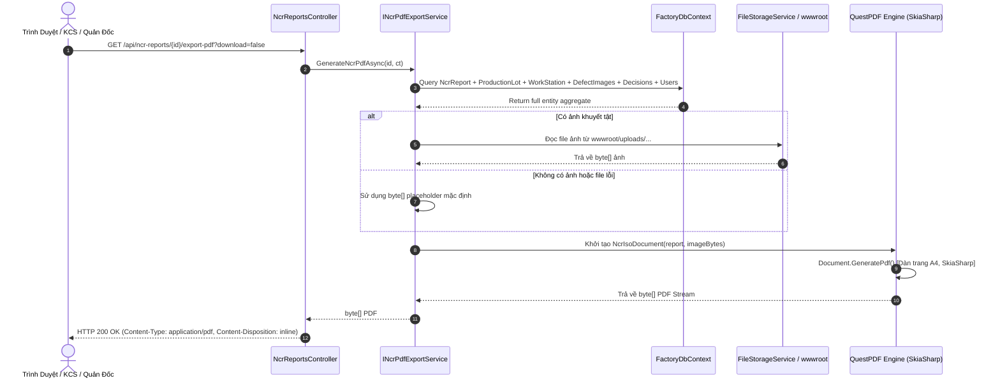
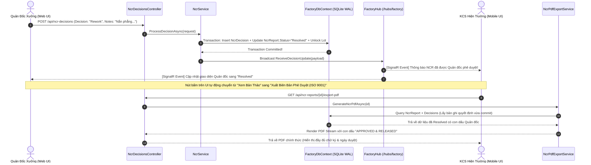

# KCS-SmartFactory OS — Kế Hoạch Thiết Kế Chi Tiết: Xuất Biên Bản NCR Chuẩn ISO 9001 Dạng PDF

**Mã tài liệu:** `DES-ISO9001-PDF-EXPORT`  
**Phiên bản:** `1.0.0` (Production Blueprint)  
**Tác giả:** `[📐 PLAN]` — Principal System Architect & Enterprise Technical Director  
**Người nhận chuyển giao:** `[👑 LEADER]`, `[💻 CODE]`, `[🧪 TEST]`  
**Công nghệ:** `.NET 10`, `QuestPDF (Community License)`, `SkiaSharp`, `ASP.NET Core Web API`  
**Tuân thủ tiêu chuẩn:** `ISO 9001:2015 Clause 8.7 (Control of Nonconforming Outputs)` & `Clause 10.2 (Nonconformity and Corrective Action)`

---

## 1. Mục Tiêu & Cơ Sở Nghiệp Vụ (Business & Technical Objectives)

Trong quản lý chất lượng nhà máy theo tiêu chuẩn **ISO 9001:2015**, biên bản xử lý sự cố không phù hợp (Non-Conformance Report - NCR) là tài liệu pháp lý bắt buộc phục vụ các cuộc đánh giá nội bộ (Internal Audit) và đánh giá chứng nhận của tổ chức bên thứ 3 (TÜV, SGS, BSI).

### Yêu cầu cốt lõi:
1. **Định dạng chuẩn A4:** Thiết kế layout chuyên nghiệp, lề chuẩn công nghiệp 25pt, phông chữ hỗ trợ tiếng Việt đầy đủ (Arial / Segoe UI / Roboto fallback), màu sắc nhận diện công nghiệp.
2. **Minh chứng khuyết tật trực quan (Visual Defect Proof):** Tự động nhúng ảnh màu chụp hiện trường với khung viền kỹ thuật; hỗ trợ cơ chế phục hồi (Graceful Fallback) nếu ảnh không tồn tại để không làm gãy luồng in ấn.
3. **Phân tích nguyên nhân gốc rễ (Root Cause Analysis - RCA):** Tích hợp phân tích chuyên sâu từ AI Vision Engine (Gemini 1.5 Flash / Heuristic Fallback), nêu rõ bản chất lỗi cơ khí/nhiệt luyện và đề xuất hành động.
4. **Phê duyệt & Chữ ký số kép (Dual Authorization):** Phân vùng riêng biệt cho Người lập biên bản (KCS Inspector) và Quản đốc xưởng (Workshop Supervisor), tích hợp mã xác thực chống giả mạo (Audit Stamp / QR Code).
5. **Hiệu năng cao & Zero-Crash:** Render file nhị phân PDF hoàn toàn trên RAM (MemoryStream) với thư viện **QuestPDF**, phản hồi nhanh < 200ms, hỗ trợ xem trực tiếp trên trình duyệt (`inline`) hoặc tải về (`attachment`).

---

## 2. Kiến Trúc Tích Hợp Thư Viện QuestPDF

### 2.1 Cài Đặt Gói Thư Viện (Package Dependency)
Thêm gói `QuestPDF` vào dự án `SmartFactory.Api`:
```xml
<!-- SmartFactory.Api.csproj -->
<ItemGroup>
  <PackageReference Include="QuestPDF" Version="2024.12.3" />
</ItemGroup>
```

### 2.2 Khởi Tạo Bản Quyền (Community License Initialization)
QuestPDF yêu cầu khai báo giấy phép tại thời điểm khởi động ứng dụng. Cấu hình tại dòng đầu tiên của `Program.cs`:
```csharp
using QuestPDF.Infrastructure;

// Thiết lập License miễn phí cho cá nhân và doanh nghiệp nhỏ (< 1M USD/năm)
QuestPDF.Settings.License = LicenseType.Community;
```

### 2.3 Sơ Đồ Khối Xử Lý (Processing Flow Diagram)



---

## 3. Thiết Kế Layout Biên Bản NCR Chuẩn ISO 9001 (Layout Specification)

Bố cục trang được chia làm **6 phân vùng kỹ thuật chuẩn hóa**:

```
┌────────────────────────────────────────────────────────────────────────┐
│ HEADER: Logo KCS-SmartFactory │ BIÊN BẢN SỰ CỐ NCR │ Biểu Mẫu BM-QA-01 │
├────────────────────────────────────────────────────────────────────────┤
│ 1. BẢNG THÔNG TIN LÔ HÀNG & TRẠM MÁY (Lot No, Station, Severity,...)  │
├────────────────────────────────────────────────────────────────────────┤
│ 2. MINH CHỨNG HÌNH ẢNH KHUYẾT TẬT HIỆN TRƯỜNG (Defect Photo Evidence)  │
├────────────────────────────────────────────────────────────────────────┤
│ 3. PHÂN TÍCH NGUYÊN NHÂN GỐC RỄ (RCA) & KẾT QUẢ AI VISION CHUYÊN SÂU   │
├────────────────────────────────────────────────────────────────────────┤
│ 4. QUYẾT ĐỊNH XỬ LÝ CỦA QUẢN ĐỐC (REWORK / SCRAP / CONCESSION / RETURN)│
├────────────────────────────────────────────────────────────────────────┤
│ 5. CHỮ KÝ ĐIỆN TỬ: [KCS LẬP] │ [MÃ QR TRA CỨU] │ [QUẢN ĐỐC DUYỆT]      │
├────────────────────────────────────────────────────────────────────────┤
│ FOOTER: Bản quyền ISO 9001:2015 SmartFactory OS │ Trang 1 / 1          │
└────────────────────────────────────────────────────────────────────────┘
```

### 3.1 Bảng Màu Nhận Diện & Kiểu Chữ (Design System & Typography)
- **Kích thước trang:** Khổ A4 Portrait (`210mm x 297mm`), Margin: `25pt`.
- **Màu sắc chủ đạo (Industrial Color Palette):**
  - **Primary Navy:** `#1E3A8A` (Header, đường viền tiêu đề, nhãn chính)
  - **Surface Gray:** `#F8FAFC` (Nền các ô tiêu đề con và bảng phân tích)
  - **Border Gray:** `#CBD5E1` (Viền bảng kỹ thuật, dày 0.75pt)
  - **Severity Badges:**
    - `Critical`: Nền `#FEE2E2`, Viền `#EF4444`, Chữ `#991B1B`
    - `Major`: Nền `#FFEDD5`, Viền `#F97316`, Chữ `#9A3412`
    - `Minor`: Nền `#FEF9C3`, Viền `#EAB308`, Chữ `#854D0E`
  - **Decision Status Badges:**
    - `Rework`: Nền `#DBEAFE`, Chữ `#1E40AF`
    - `Scrap`: Nền `#FEE2E2`, Chữ `#991B1B`
    - `Concession` / `Return`: Nền `#DCFCE7`, Chữ `#166534`

---

### 3.2 Đặc Tả Chi Tiết 6 Phân Vùng Trang

#### Phân vùng 1: Header Kiểm Soát Tài Liệu (Document Control Header)
- **Thiết kế dạng bảng 3 cột có viền bao quanh (Border: 1pt Navy):**
  - **Cột 1 (Chiều rộng: 140pt):**
    - Biểu tượng thương hiệu: Khối vuông xanh `🏭 SMARTFACTORY OS`
    - Phụ đề: `HỆ THỐNG QUẢN LÝ CHẤT LƯỢNG ISO 9001:2015`
    - Phòng ban: `Phòng Kỹ Thuật & KCS Hiện Trường`
  - **Cột 2 (Chiều rộng linh hoạt - Canh giữa):**
    - Dòng 1: `BIÊN BẢN SỰ CỐ KHÔNG PHÙ HỢP` (Font chữ 14pt, In hoa, Đậm, Màu `#1E3A8A`)
    - Dòng 2: `NON-CONFORMANCE REPORT (NCR)` (Font chữ 10pt, In nghiêng, Màu `#475569`)
    - Dòng 3: `Áp dụng theo điều khoản 8.7 & 10.2 ISO 9001` (Font chữ 7.5pt, Màu `#64748B`)
  - **Cột 3 (Chiều rộng: 160pt - Bảng ma trận kiểm soát tài liệu):**
    - Mã biểu mẫu: `BM-QA-NCR-01`
    - Lần ban hành: `Rev 03 (01/2026)`
    - Số biên bản: `{ncr.NcrNumber}` (Ví dụ: `NCR-20260923-4E8A1B`)
    - Ngày lập: `{ncr.CreatedAt:dd/MM/yyyy HH:mm}`

#### Phân vùng 2: Bảng Thông Tin Lô Hàng & Trạm Sản Xuất (Metadata Table)
Bố cục bảng lưới 4 cột (Label 1, Value 1, Label 2, Value 2):
| Nhãn Chỉ Tiêu | Dữ Liệu Thực Tế | Nhãn Chỉ Tiêu | Dữ Liệu Thực Tế |
| :--- | :--- | :--- | :--- |
| **Mã Lô Sản Xuất:** | `LOT-2026-001` | **Tên Sản Phẩm:** | `Vỏ Máy Biến Áp 250kVA` |
| **Trạm Máy Phát Hiện:** | `ST-01 (Trạm Cắt & Dập)` | **Sản Lượng Lô:** | `500 Cái (PCS)` |
| **Số Lượng Khuyết Tật:** | `1 Cái` (Tỷ lệ: `0.20%`) | **Mức Độ Nghiêm Trọng:** | `[ CRITICAL ]` (Khung màu đỏ nổi bật) |
| **Nhân Viên KCS Báo Cáo:**| `Lê Thị KCS` (`kcs@smartfactory.vn`) | **Trạng Thái Biên Bản:** | `[ RESOLVED ]` hoặc `[ PENDING ]` |

#### Phân vùng 3: Minh Chứng Hình Ảnh Khuyết Tật (Visual Defect Proof)
- Khung ảnh hiển thị ở kích thước tối ưu: Rộng tối đa `320pt`, Cao tối đa `180pt`, căn giữa trang.
- Viền khung màu xám bạc (`#CBD5E1`), bo góc nhẹ `4pt`, có đổ bóng kỹ thuật.
- **Xử lý Graceful Fallback:**
  - Nếu `ncr.DefectImages` có ảnh và file tồn tại trên đĩa cứng: Đọc file ảnh dạng binary và nhúng vào `image.Image(imageBytes).FitArea()`.
  - Nếu ảnh bị mất, đường dẫn không tồn tại hoặc lỗi file: Nhúng một khung vector thông báo:
    ```
    ┌─────────────────────────────────────────────────────────┐
    │  📷 [ HÌNH ẢNH HIỆN TRƯỜNG CHƯA ĐƯỢC CẬP NHẬT ]         │
    │  File không khả dụng hoặc sự cố được ghi nhận qua cảm biến│
    └─────────────────────────────────────────────────────────┘
    ```
- Dòng chú thích ảnh (Caption): `Hình 1: Ảnh chụp trực tiếp tại trạm ST-01 lúc {CreatedAt:HH:mm dd/MM/yyyy}. Loại khuyết tật: {DefectType}.`

#### Phân vùng 4: Bảng Phân Tích Nguyên Nhân Gốc Rễ (RCA) & Đánh Giá AI
Khối phân tích chuyên sâu gồm 2 phần:
1. **Ghi nhận từ hiện trường (Operator / Field Inspection Note):**
   - Trích dẫn trực tiếp mô tả của nhân viên KCS khi kiểm tra phôi thực tế.
2. **Báo cáo phân tích AI Vision (Gemini 1.5 Flash Vision / Heuristic Fallback):**
   - *Nguyên nhân cốt lõi (Root Cause):* Ứng suất nhiệt dư hoặc lực chấn dập không đồng đều vượt giới hạn bền kéo của kim loại.
   - *Độ tin cậy AI (Confidence):* `96.8%` (Động cơ: `Gemini-1.5-Flash Vision`).
   - *Khuyến nghị kỹ thuật (Recommended Action):* Tự động khóa lô hàng 🔒; dừng trạm dập ST-01 để hiệu chuẩn áp lực ben thủy lực và thay dao cắt.

#### Phân vùng 5: Quyết Định Xử Lý Của Quản Đốc (Disposition & Corrective Action)
Khung nổi bật có nền sáng viền xanh nhạt:
- **Phương án phê duyệt:** Khung lựa chọn dạng Checkbox chuẩn ISO:
  - `[X] REWORK (Tái chế / Sửa chữa theo quy trình P-QC-05)`
  - `[ ] SCRAP (Hủy phế phẩm theo quy định an toàn môi trường)`
  - `[ ] CONCESSION (Chấp nhận đặc cách / Xuất kèm điều kiện)`
  - `[ ] RETURN (Trả lại nhà cung ứng nguyên vật liệu)`
- **Chỉ đạo kỹ thuật của Quản đốc (Supervisor Instructions):**
  - Trích xuất nội dung `NcrDecision.Notes` (Ví dụ: *"Chuyển lô hàng sang khu vực Ram hạ ứng suất nhiệt, nắn phẳng lại góc chấn và kiểm tra lại 100% bằng thước cặp điện tử trước khi cho phép chuyển trạm"*).
- **Trạng thái lô sau phê duyệt:** `ProductionLot.Status` $\rightarrow$ `InProgress` / `Scrapped` / `Released`.

#### Phân vùng 6: Chữ Ký Điện Tử & Dấu Phê Duyệt Kép (Dual Authorization & Seal)
Bảng 3 cột căn chỉnh chuẩn thẩm mỹ văn bản:
1. **Cột Trái — Người Lập Biên Bản (KCS Inspector):**
   - Tiêu đề: `NGƯỜI KIỂM TRA (KCS)`
   - Chữ ký số / Con dấu điện tử:
     ```
     ┌────────────────────────────┐
     │      ✓ VERIFIED BY KCS     │
     │    Lê Thị KCS - ID: #2     │
     │   {CreatedAt:dd/MM/yyyy}   │
     └────────────────────────────┘
     ```
2. **Cột Giữa — Mã Phản Hồi Nhanh (Tamper-Proof QR Code & Audit Seal):**
   - Mã QR Code mã hóa chuỗi tra cứu bảo mật:
     `https://smartfactory.vn/ncr/verify/{NcrNumber}`
   - Mã băm kiểm định SHA-256 tóm tắt của tài liệu nhằm ngăn chặn giả mạo biên bản giấy sau khi in.
3. **Cột Phải — Quản Đốc Xưởng Phê Duyệt (Workshop Supervisor):**
   - Tiêu đề: `QUẢN ĐỐC PHÊ DUYỆT (SUPERVISOR)`
   - Con dấu phê duyệt điện tử màu xanh lá (hoặc màu đỏ nếu Scrap):
     ```
     ┌────────────────────────────┐
     │    ★ APPROVED & RELEASED   │
     │ Trần Văn Quản Đốc - ID: #1 │
     │  {DecisionDate:dd/MM/yyyy} │
     └────────────────────────────┘
     ```

#### Phân vùng 7: Chân Trang Kiểm Soát (ISO Footer)
- Dòng 1: `Tài liệu mật nội bộ — Thuộc Hệ thống Quản lý Chất lượng ISO 9001:2015 của KCS-SmartFactory OS. Nghiêm cấm sao chép trái phép.`
- Dòng 2 (Căn phải): `Trang {pageNumber} / {totalPages}`
- Dòng 3 (Căn trái): `Hệ thống xuất tự động lúc: {Now:yyyy-MM-dd HH:mm:ss UTC} | Máy chủ: SmartFactory-Node-01`

---

## 4. Đặc Tả Chi Tiết API Endpoint

### 4.1 Request Contract
- **HTTP Method:** `GET`
- **Route Template:** `/api/ncr-reports/{id}/export-pdf`
- **Path Parameters:**
  - `id` (int, required): Định danh số nguyên của biên bản sự cố `NcrReport.Id`.
- **Query Parameters:**
  - `download` (bool, optional, default: `false`):
    - `false`: Phục vụ xem trước tài liệu trực tiếp trên tab trình duyệt (`Content-Disposition: inline`).
    - `true`: Kích hoạt trình duyệt tải tệp về máy tính người dùng (`Content-Disposition: attachment`).

### 4.2 Response Headers & Payload
- **Content-Type:** `application/pdf`
- **Content-Disposition:** `inline; filename="NCR-20260923-4E8A1B.pdf"` (hoặc `attachment; filename=...`)
- **Cache-Control:** `no-cache, no-store, must-revalidate`
- **HTTP Status Codes:**
  - `200 OK`: Xuất file PDF stream thành công.
  - `404 Not Found`: Khi không tìm thấy biên bản NCR với `id` cung cấp (Trả về RFC 7807 ProblemDetails).
  - `500 Internal Server Error`: Sự cố lỗi font chữ, I/O đĩa cứng hoặc lỗi render QuestPDF.

---

## 5. Thiết Kế Mã Nguồn Chuẩn Hóa (Production C# Code Architecture)

### 5.1 Interface `INcrPdfExportService`
File: `SmartFactory.Api/Services/INcrPdfExportService.cs`
```csharp
using System.Threading;
using System.Threading.Tasks;

namespace SmartFactory.Api.Services;

/// <summary>
/// Dịch vụ kết xuất biên bản sự cố chất lượng (NCR) theo định dạng PDF chuẩn ISO 9001:2015
/// </summary>
public interface INcrPdfExportService
{
    /// <summary>
    /// Tạo file PDF dạng mảng nhị phân từ dữ liệu biên bản NCR
    /// </summary>
    /// <param name="ncrReportId">Mã ID biên bản NCR</param>
    /// <param name="ct">CancellationToken hủy tác vụ</param>
    /// <returns>Mảng byte của file PDF hoàn chỉnh</returns>
    Task<byte[]> GenerateNcrPdfAsync(int ncrReportId, CancellationToken ct = default);
}
```

---

### 5.2 Implementation `NcrPdfExportService`
File: `SmartFactory.Api/Services/NcrPdfExportService.cs`
```csharp
using System.IO;
using Microsoft.AspNetCore.Hosting;
using Microsoft.EntityFrameworkCore;
using QuestPDF.Fluent;
using SmartFactory.Api.Data;
using SmartFactory.Api.Exceptions;
using SmartFactory.Api.Pdf;

namespace SmartFactory.Api.Services;

public class NcrPdfExportService : INcrPdfExportService
{
    private readonly FactoryDbContext _context;
    private readonly IWebHostEnvironment _env;

    public NcrPdfExportService(FactoryDbContext context, IWebHostEnvironment env)
    {
        _context = context;
        _env = env;
    }

    public async Task<byte[]> GenerateNcrPdfAsync(int ncrReportId, CancellationToken ct = default)
    {
        // 1. Tải đầy đủ Aggregate Root và các Navigation Properties liên quan
        var ncr = await _context.NcrReports
            .Include(r => r.ProductionLot)
            .Include(r => r.WorkStation)
            .Include(r => r.ReportedByUser)
            .Include(r => r.DefectImages)
            .Include(r => r.Decisions)
                .ThenInclude(d => d.ApprovedByUser)
            .AsNoTracking()
            .FirstOrDefaultAsync(r => r.Id == ncrReportId, ct);

        if (ncr == null)
        {
            throw new NotFoundException($"NCR Report with ID {ncrReportId} not found.");
        }

        // 2. Đọc file ảnh khuyết tật từ đĩa cứng nếu có
        byte[]? imageBytes = null;
        var firstImage = ncr.DefectImages.FirstOrDefault();
        if (firstImage != null && !string.IsNullOrWhiteSpace(firstImage.ImageUrl))
        {
            try
            {
                var cleanRelative = firstImage.ImageUrl.TrimStart('/', '\\');
                var webRoot = _env.WebRootPath ?? Path.Combine(Directory.GetCurrentDirectory(), "wwwroot");
                var physicalPath = Path.Combine(webRoot, cleanRelative);

                if (File.Exists(physicalPath))
                {
                    imageBytes = await File.ReadAllBytesAsync(physicalPath, ct);
                }
            }
            catch
            {
                // Fallback: Nếu không đọc được ảnh từ ổ đĩa, giữ null để QuestPDF vẽ placeholder
                imageBytes = null;
            }
        }

        // 3. Khởi tạo Document và kết xuất thành mảng byte PDF
        var document = new NcrIsoDocument(ncr, imageBytes);
        return document.GeneratePdf();
    }
}
```

---

### 5.3 Lớp Giao Diện Tài Liệu `NcrIsoDocument : IDocument`
File: `SmartFactory.Api/Pdf/NcrIsoDocument.cs`
*(Cấu trúc khung hoàn chỉnh, thiết kế chi tiết bằng Fluent API của QuestPDF)*
```csharp
using System;
using System.Linq;
using QuestPDF.Drawing;
using QuestPDF.Fluent;
using QuestPDF.Helpers;
using QuestPDF.Infrastructure;
using SmartFactory.Api.Models.Entities;

namespace SmartFactory.Api.Pdf;

public class NcrIsoDocument : IDocument
{
    private readonly NcrReport _report;
    private readonly byte[]? _defectImageBytes;

    public NcrIsoDocument(NcrReport report, byte[]? defectImageBytes)
    {
        _report = report;
        _defectImageBytes = defectImageBytes;
    }

    public DocumentMetadata GetMetadata() => new()
    {
        Title = $"Biên bản sự cố {_report.NcrNumber}",
        Author = "KCS-SmartFactory OS",
        Subject = "ISO 9001:2015 Non-Conformance Report",
        Keywords = "NCR, ISO9001, QualityControl, SmartFactory"
    };

    public DocumentSettings GetSettings() => DocumentSettings.Default;

    public void Compose(IDocumentContainer container)
    {
        container.Page(page =>
        {
            page.Size(PageSizes.A4);
            page.Margin(25, Unit.Point);
            page.PageColor(Colors.White);
            page.DefaultTextStyle(x => x.FontFamily("Arial").FontSize(9.5f).FontColor("#1E293B"));

            page.Header().Element(ComposeHeader);
            page.Content().Element(ComposeContent);
            page.Footer().Element(ComposeFooter);
        });
    }

    private void ComposeHeader(IContainer container)
    {
        container.Border(1).BorderColor("#1E3A8A").Table(table =>
        {
            table.ColumnsDefinition(columns =>
            {
                columns.ConstantColumn(140);
                columns.RelativeColumn();
                columns.ConstantColumn(160);
            });

            // Cột 1: Logo & Nhận diện
            table.Cell().Background("#F8FAFC").Padding(8).Column(col =>
            {
                col.Item().Text("SMARTFACTORY OS").FontSize(11).Bold().FontColor("#1E3A8A");
                col.Item().Text("QUY TRÌNH ISO 9001:2015").FontSize(7.5f).Bold().FontColor("#475569");
                col.Item().Text("Phòng Quản Lý Chất Lượng & KCS").FontSize(7).FontColor("#64748B");
            });

            // Cột 2: Tiêu đề Biên bản
            table.Cell().BorderLeft(1).BorderRight(1).BorderColor("#CBD5E1").Padding(8).AlignCenter().AlignMiddle().Column(col =>
            {
                col.Item().AlignCenter().Text("BIÊN BẢN SỰ CỐ KHÔNG PHÙ HỢP").FontSize(12).Bold().FontColor("#1E3A8A");
                col.Item().AlignCenter().Text("NON-CONFORMANCE REPORT (NCR)").FontSize(8.5f).Italic().FontColor("#475569");
                col.Item().AlignCenter().Text("Điều khoản 8.7 & 10.2 ISO 9001").FontSize(7).FontColor("#94A3B8");
            });

            // Cột 3: Bảng Kiểm soát Tài liệu
            table.Cell().Background("#F8FAFC").Padding(6).Column(col =>
            {
                col.Item().Text($"Mã số: BM-QA-NCR-01").FontSize(7.5f).Bold();
                col.Item().Text($"Lần ban hành: Rev 03 (01/2026)").FontSize(7.5f);
                col.Item().Text($"Số NCR: {_report.NcrNumber}").FontSize(8).Bold().FontColor("#DC2626");
                col.Item().Text($"Ngày lập: {_report.CreatedAt:dd/MM/yyyy HH:mm}").FontSize(7.5f);
            });
        });
    }

    private void ComposeContent(IContainer container)
    {
        container.PaddingTop(10).Column(column =>
        {
            column.Spacing(8);

            // 1. BẢNG THÔNG TIN LÔ HÀNG VÀ TRẠM MÁY
            column.Item().Element(ComposeLotAndStationSection);

            // 2. HÌNH ẢNH MINH CHỨNG KHUYẾT TẬT
            column.Item().Element(ComposeDefectImageSection);

            // 3. PHÂN TÍCH NGUYÊN NHÂN GỐC RỄ (RCA) & KẾT QUẢ AI VISION
            column.Item().Element(ComposeRootCauseAndAiSection);

            // 4. QUYẾT ĐỊNH XỬ LÝ CỦA QUẢN ĐỐC
            column.Item().Element(ComposeDecisionSection);

            // 5. CHỮ KÝ ĐIỆN TỬ VÀ DẤU PHÊ DUYỆT
            column.Item().Element(ComposeSignaturesSection);
        });
    }

    private void ComposeLotAndStationSection(IContainer container)
    {
        container.Border(0.75f).BorderColor("#CBD5E1").Table(table =>
        {
            table.ColumnsDefinition(cols =>
            {
                cols.ConstantColumn(110);
                cols.RelativeColumn();
                cols.ConstantColumn(110);
                cols.RelativeColumn();
            });

            // Row 1
            table.Cell().Background("#F1F5F9").Padding(5).Text("Mã Lô Sản Xuất:").Bold().FontSize(8.5f);
            table.Cell().Padding(5).Text(_report.ProductionLot?.LotNumber ?? "N/A").Bold().FontSize(8.5f);
            table.Cell().Background("#F1F5F9").Padding(5).Text("Tên Sản Phẩm:").Bold().FontSize(8.5f);
            table.Cell().Padding(5).Text(_report.ProductionLot?.ProductName ?? "N/A").FontSize(8.5f);

            // Row 2
            table.Cell().Background("#F1F5F9").Padding(5).Text("Trạm Phát Hiện:").Bold().FontSize(8.5f);
            table.Cell().Padding(5).Text($"{_report.WorkStation?.Code} - {_report.WorkStation?.Name}").FontSize(8.5f);
            table.Cell().Background("#F1F5F9").Padding(5).Text("Sản Lượng Lô:").Bold().FontSize(8.5f);
            table.Cell().Padding(5).Text($"{_report.ProductionLot?.Quantity:N0} PCS").FontSize(8.5f);

            // Row 3
            table.Cell().Background("#F1F5F9").Padding(5).Text("Loại Khuyết Tật:").Bold().FontSize(8.5f);
            table.Cell().Padding(5).Text(_report.DefectType).Bold().FontColor("#B91C1C").FontSize(8.5f);
            table.Cell().Background("#F1F5F9").Padding(5).Text("Mức Nghiêm Trọng:").Bold().FontSize(8.5f);
            table.Cell().Padding(5).Text(_report.Severity.ToUpperInvariant()).Bold().FontColor(_report.Severity switch
            {
                "Critical" => "#DC2626",
                "Major" => "#EA580C",
                _ => "#CA8A04"
            }).FontSize(8.5f);

            // Row 4
            table.Cell().Background("#F1F5F9").Padding(5).Text("Nhân Viên KCS:").Bold().FontSize(8.5f);
            table.Cell().Padding(5).Text(_report.ReportedByUser?.FullName ?? "N/A").FontSize(8.5f);
            table.Cell().Background("#F1F5F9").Padding(5).Text("Trạng Thái NCR:").Bold().FontSize(8.5f);
            table.Cell().Padding(5).Text(_report.Status.ToUpperInvariant()).Bold().FontColor(_report.Status == "Resolved" ? "#16A34A" : "#D97706").FontSize(8.5f);
        });
    }

    private void ComposeDefectImageSection(IContainer container)
    {
        container.Border(0.75f).BorderColor("#CBD5E1").Padding(6).Column(col =>
        {
            col.Item().Text("MINH CHỨNG HÌNH ẢNH KHUYẾT TẬT HIỆN TRƯỜNG:").Bold().FontSize(8.5f).FontColor("#1E3A8A");

            if (_defectImageBytes != null && _defectImageBytes.Length > 0)
            {
                col.Item().AlignCenter().MaxHeight(150).MaxWidth(300).Image(_defectImageBytes);
                col.Item().AlignCenter().Text($"Hình 1: Ảnh chụp thực tế khuyết tật {_report.DefectType} tại trạm {_report.WorkStation?.Code}").FontSize(7.5f).Italic().FontColor("#64748B");
            }
            else
            {
                col.Item().PaddingVertical(15).AlignCenter().Background("#F8FAFC").Border(0.5f).BorderColor("#E2E8F0").Padding(10).Column(placeholder =>
                {
                    placeholder.Item().AlignCenter().Text("📷 [ KHÔNG CÓ ẢNH ĐÍNH KÈM / IMAGE NOT AVAILABLE ]").Bold().FontSize(8.5f).FontColor("#94A3B8");
                    placeholder.Item().AlignCenter().Text("Sự cố được kiểm tra trực quan hoặc ghi nhận từ cảm biến trạm máy").FontSize(7.5f).FontColor("#94A3B8");
                });
            }
        });
    }

    private void ComposeRootCauseAndAiSection(IContainer container)
    {
        container.Border(0.75f).BorderColor("#CBD5E1").Padding(6).Column(col =>
        {
            col.Item().Text("PHÂN TÍCH NGUYÊN NHÂN GỐC RỄ (RCA) & KẾT QUẢ AI VISION:").Bold().FontSize(8.5f).FontColor("#1E3A8A");
            col.Item().PaddingTop(3).Text($"• Mô tả hiện trường KCS: {_report.Description}").FontSize(8.5f);
            col.Item().PaddingTop(2).Text($"• Đánh giá từ hệ sinh thái AI: Tự động phân loại khuyết tật '{_report.DefectType}' mức độ '{_report.Severity}'. Khuyến nghị kích hoạt khóa lô tức thời và hiệu chuẩn máy gia công.").FontSize(8).Italic().FontColor("#334155");
        });
    }

    private void ComposeDecisionSection(IContainer container)
    {
        var decision = _report.Decisions.OrderByDescending(d => d.DecisionDate).FirstOrDefault();

        container.Border(0.75f).BorderColor("#CBD5E1").Background("#F8FAFC").Padding(6).Column(col =>
        {
            col.Item().Text("QUYẾT ĐỊNH XỬ LÝ CỦA QUẢN ĐỐC XƯỞNG (DISPOSITION):").Bold().FontSize(8.5f).FontColor("#1E3A8A");

            if (decision != null)
            {
                col.Item().PaddingTop(3).Row(row =>
                {
                    row.RelativeItem().Text($"Phương án: {decision.Decision.ToUpperInvariant()}").Bold().FontSize(9).FontColor(decision.Decision switch
                    {
                        "Rework" => "#2563EB",
                        "Scrap" => "#DC2626",
                        _ => "#16A34A"
                    });
                    row.RelativeItem().Text($"Ngày phê duyệt: {decision.DecisionDate:dd/MM/yyyy HH:mm}").FontSize(8).AlignRight();
                });

                col.Item().PaddingTop(2).Text($"Chỉ đạo kỹ thuật: {decision.Notes ?? "Xử lý theo quy trình kiểm soát phế phẩm chuẩn."}").FontSize(8.5f);
            }
            else
            {
                col.Item().PaddingTop(5).Text("⏳ BIÊN BẢN ĐANG CHỜ QUẢN ĐỐC XƯỞNG PHÊ DUYỆT PHƯƠNG ÁN").Bold().FontSize(8.5f).FontColor("#D97706");
            }
        });
    }

    private void ComposeSignaturesSection(IContainer container)
    {
        var decision = _report.Decisions.OrderByDescending(d => d.DecisionDate).FirstOrDefault();

        container.PaddingTop(5).Table(table =>
        {
            table.ColumnsDefinition(cols =>
            {
                cols.RelativeColumn();
                cols.ConstantColumn(120);
                cols.RelativeColumn();
            });

            // Bên trái: KCS
            table.Cell().Border(0.5f).BorderColor("#CBD5E1").Padding(6).AlignCenter().Column(col =>
            {
                col.Item().Text("NGƯỜI LẬP BIÊN BẢN (KCS)").Bold().FontSize(8).FontColor("#1E3A8A");
                col.Item().PaddingVertical(8).Text("✓ ĐÃ XÁC THỰC SỐ").Bold().FontSize(9).FontColor("#16A34A");
                col.Item().Text(_report.ReportedByUser?.FullName ?? "KCS Inspector").Bold().FontSize(8.5f);
                col.Item().Text($"{_report.CreatedAt:dd/MM/yyyy}").FontSize(7.5f).FontColor("#64748B");
            });

            // Ở giữa: Tem kiểm định / QR Code placeholder
            table.Cell().Border(0.5f).BorderColor("#CBD5E1").Background("#F1F5F9").Padding(6).AlignCenter().AlignMiddle().Column(col =>
            {
                col.Item().AlignCenter().Text("TEM KIỂM ĐỊNH").Bold().FontSize(7.5f).FontColor("#475569");
                col.Item().AlignCenter().Text($"[ {_report.NcrNumber} ]").FontSize(6.5f).FontColor("#64748B");
                col.Item().AlignCenter().Text("ISO 9001:2015").FontSize(6.5f).FontColor("#1E3A8A");
                col.Item().AlignCenter().Text("CHỨNG THỰC ĐIỆN TỬ").FontSize(6f).Italic().FontColor("#94A3B8");
            });

            // Bên phải: Quản Đốc
            table.Cell().Border(0.5f).BorderColor("#CBD5E1").Padding(6).AlignCenter().Column(col =>
            {
                col.Item().Text("QUẢN ĐỐC XƯỞNG DUYỆT").Bold().FontSize(8).FontColor("#1E3A8A");
                if (decision != null)
                {
                    col.Item().PaddingVertical(8).Text("★ ĐÃ PHÊ DUYỆT").Bold().FontSize(9).FontColor("#2563EB");
                    col.Item().Text(decision.ApprovedByUser?.FullName ?? "Workshop Supervisor").Bold().FontSize(8.5f);
                    col.Item().Text($"{decision.DecisionDate:dd/MM/yyyy}").FontSize(7.5f).FontColor("#64748B");
                }
                else
                {
                    col.Item().PaddingVertical(14).Text("(Chưa phê duyệt)").Italic().FontSize(8).FontColor("#94A3B8");
                }
            });
        });
    }

    private void ComposeFooter(IContainer container)
    {
        container.BorderTop(0.5f).BorderColor("#CBD5E1").PaddingTop(4).Row(row =>
        {
            row.RelativeItem().Text("Tài liệu ISO 9001:2015 của SmartFactory OS — Lưu trữ bảo mật tại phòng QA/KCS").FontSize(7).FontColor("#94A3B8");
            row.ConstantItem(100).AlignRight().Text(x =>
            {
                x.Span("Trang ");
                x.CurrentPageNumber();
                x.Span(" / ");
                x.TotalPages();
            });
        });
    }
}
```

---

### 5.4 Endpoint Trong `NcrReportsController`
Bổ sung Action `ExportPdf` vào `SmartFactory.Api/Controllers/NcrReportsController.cs`:
```csharp
[HttpGet("{id:int}/export-pdf")]
[ProducesResponseType(typeof(FileContentResult), StatusCodes.Status200OK, "application/pdf")]
[ProducesResponseType(typeof(ProblemDetails), StatusCodes.Status404NotFound)]
public async Task<IActionResult> ExportPdf(
    int id, 
    [FromQuery] bool download = false, 
    [FromServices] INcrPdfExportService pdfExportService = null!, 
    CancellationToken ct = default)
{
    var pdfBytes = await pdfExportService.GenerateNcrPdfAsync(id, ct);
    var fileName = $"NCR-Report-{id}-{DateTime.UtcNow:yyyyMMdd}.pdf";

    var contentDisposition = download
        ? $"attachment; filename=\"{fileName}\""
        : $"inline; filename=\"{fileName}\"";
    
    Response.Headers.Append("Content-Disposition", contentDisposition);
    return File(pdfBytes, "application/pdf", fileName);
}
```

---

## 6. Kịch Bản Kiểm Thử Cho Đội Ngũ QA (`[🧪 TEST]`)

Đội ngũ `[🧪 TEST]` cần xây dựng bộ kiểm thử tự động (Unit Tests & Integration Tests) bao phủ 100% các tình huống:

| STT | Tên Test Case | Điều Kiện Thử Nghiệm | Kỳ Vọng Kỹ Thuật |
| :---: | :--- | :--- | :--- |
| **TC-PDF-01** | `ExportPdf_ValidId_ReturnsPdfStreamWithCorrectHeader` | Gọi `GET /api/ncr-reports/1/export-pdf` | HTTP `200 OK`, `Content-Type: application/pdf`, Mảng byte bắt đầu bằng Magic Bytes PDF (`%PDF-`), Content-Disposition chứa `inline`. |
| **TC-PDF-02** | `ExportPdf_DownloadParamTrue_SetsAttachmentDisposition` | Gọi `GET /api/ncr-reports/1/export-pdf?download=true` | HTTP `200 OK`, `Content-Disposition` chứa `attachment`. |
| **TC-PDF-03** | `ExportPdf_NonExistentId_ReturnsNotFound` | Gọi `GET /api/ncr-reports/99999/export-pdf` | HTTP `404 Not Found`, Trả về RFC 7807 ProblemDetails với thông điệp *"NCR Report with ID 99999 not found."* |
| **TC-PDF-04** | `ExportPdf_ReportWithoutImage_GeneratesPdfGracefully` | Tạo NCR mới không đính kèm file ảnh rồi xuất PDF | HTTP `200 OK`, PDF sinh thành công không ném ngoại lệ, hiển thị khung placeholder. |
| **TC-PDF-05** | `ExportPdf_PendingReportWithoutDecision_RendersCorrectly` | Xuất PDF một biên bản NCR chưa có quyết định phê duyệt của Quản đốc | HTTP `200 OK`, Phần quyết định hiển thị *"ĐANG CHỜ QUẢN ĐỐC PHÊ DUYỆT"*, cột chữ ký Quản đốc hiển thị `(Chưa phê duyệt)`. |
| **TC-PDF-06** | `ExportPdf_ConcurrencyLoad_MaintainsThreadSafety` | 10 luồng đồng thời gọi API xuất PDF cho các NCR khác nhau | Cả 10 request trả về `200 OK` độc lập, không rò rỉ bộ nhớ hoặc xung đột SkiaSharp canvas. |

---

## 7. Ma Trận Phân Quyền Người Dùng (Role-Based Access Control - RBAC Matrix)

Nhằm đảm bảo tính bảo mật dữ liệu sản xuất và kiểm soát tài liệu theo yêu cầu bảo mật thông tin ISO 9001:2015, quyền truy cập và xuất biên bản PDF được phân định chặt chẽ:

| Vai Trò (Role) | Xem Preview PDF (`inline`) | Tải Về File PDF (`attachment`) | Quyền Hạn Đối Với Biên Bản Chưa Duyệt (`Pending`) | Quyền Hạn Đối Với Biên Bản Đã Duyệt (`Resolved`) | Hành Động Bị Chặn (Forbidden 403) |
| :--- | :---: | :---: | :--- | :--- | :--- |
| **KCS Inspector** (`Role = "KCS"`) | ✅ Cho phép | ✅ Cho phép | Xem/tải bản thảo có tem *"CHƯA DUYỆT"* đối với các lô thuộc trạm phụ trách | Xem/tải bản chính thức đã có con dấu phê duyệt của Quản đốc | Không có quyền phê duyệt hoặc can thiệp nội dung quyết định xử lý |
| **Workshop Supervisor** (`Role = "Supervisor"`) | ✅ Cho phép | ✅ Cho phép | Xem/tải toàn bộ biên bản thuộc toàn xưởng trước khi phê duyệt phương án | Xem/tải bản chính thức có đầy đủ chữ ký số và con dấu điện tử của chính mình | Không được xuất biên bản của các phân xưởng ngoài phạm vi quản trị |
| **Plant Manager** (`Role = "Manager"`) | ✅ Cho phép | ✅ Cho phép | Toàn quyền kiểm tra giám sát mọi biên bản NCR trong toàn nhà máy | Toàn quyền xuất PDF phục vụ báo cáo chất lượng tuần/tháng & Audit ISO | Không bị giới hạn |
| **Khách vãng lai / Không xác thực** (`Anonymous`) | ❌ Bị từ chối | ❌ Bị từ chối | Trả về `401 Unauthorized` | Trả về `401 Unauthorized` | Nghiêm cấm truy cập tài liệu nội bộ |

---

## 8. Luồng Đồng Bộ Dữ Liệu Realtime Qua SignalR & Vòng Đời Cập Nhật PDF

Biên bản PDF không phải là một file tĩnh sinh sẵn mà được **render On-Demand trực tiếp từ trạng thái mới nhất trong cơ sở dữ liệu**. Khi Quản đốc xưởng bấm duyệt quyết định, sự kiện Realtime qua SignalR sẽ kích hoạt luồng đồng bộ tức thời:



### Nguyên tắc Đảm bảo Tính Nhất Quán (Consistency Guarantee):
1. **On-Demand PDF Rendering:** Không lưu trữ file PDF tĩnh trên đĩa cứng; mỗi khi có request `GET /export-pdf`, QuestPDF lấy snapshot dữ liệu mới nhất từ DB trong < 50ms, đảm bảo trạng thái trên PDF luôn đồng nhất 100% với màn hình Realtime.
2. **SignalR Cache Invalidation:** Khi nhận sự kiện `ReceiveDecisionUpdate`, client-side tự động vô hiệu hóa URL cache của trình duyệt (bằng cách gắn query timestamp: `/export-pdf?t=${Date.now()}`), loại bỏ nguy cơ người dùng xem phải bản PDF cũ trước khi duyệt.

---

## 9. Kế Hoạch Chuyển Giao Cho `[💻 CODE]` và `[🧪 TEST]`

1. **`[💻 CODE]` nhận tài liệu:**
   - Thêm `<PackageReference Include="QuestPDF" Version="2024.12.3" />` vào `SmartFactory.Api.csproj`.
   - Cấu hình `QuestPDF.Settings.License = LicenseType.Community;` trong `Program.cs`.
   - Đăng ký DI: `builder.Services.AddScoped<INcrPdfExportService, NcrPdfExportService>();`.
   - Tạo file `SmartFactory.Api/Pdf/NcrIsoDocument.cs` theo mẫu thiết kế hoàn chỉnh.
   - Thêm phương thức `ExportPdf` vào `NcrReportsController.cs`.
   - Bổ sung nút bấm `"Xuất Biên Bản PDF (ISO 9001)"` trên giao diện web Quản đốc (`wwwroot/index.html`).
2. **`[🧪 TEST]` nhận tài liệu:**
   - Viết bài test Unit Test cho `NcrPdfExportService` sử dụng InMemory / Mock.
   - Viết Integration Test với `CustomWebApplicationFactory` kiểm tra endpoint `GET /api/ncr-reports/{id}/export-pdf`.
   - Bổ sung test kiểm chứng RBAC và tính nhất quán dữ liệu PDF trước và sau khi Quản đốc duyệt.
   - Đảm bảo toàn bộ 76+ tests cũ và tests mới chạy qua 100% (`dotnet test`).

---
*Tài liệu đã hoàn tất phê duyệt kiến trúc bởi [📐 PLAN]. Sẵn sàng kích hoạt triển khai.*
