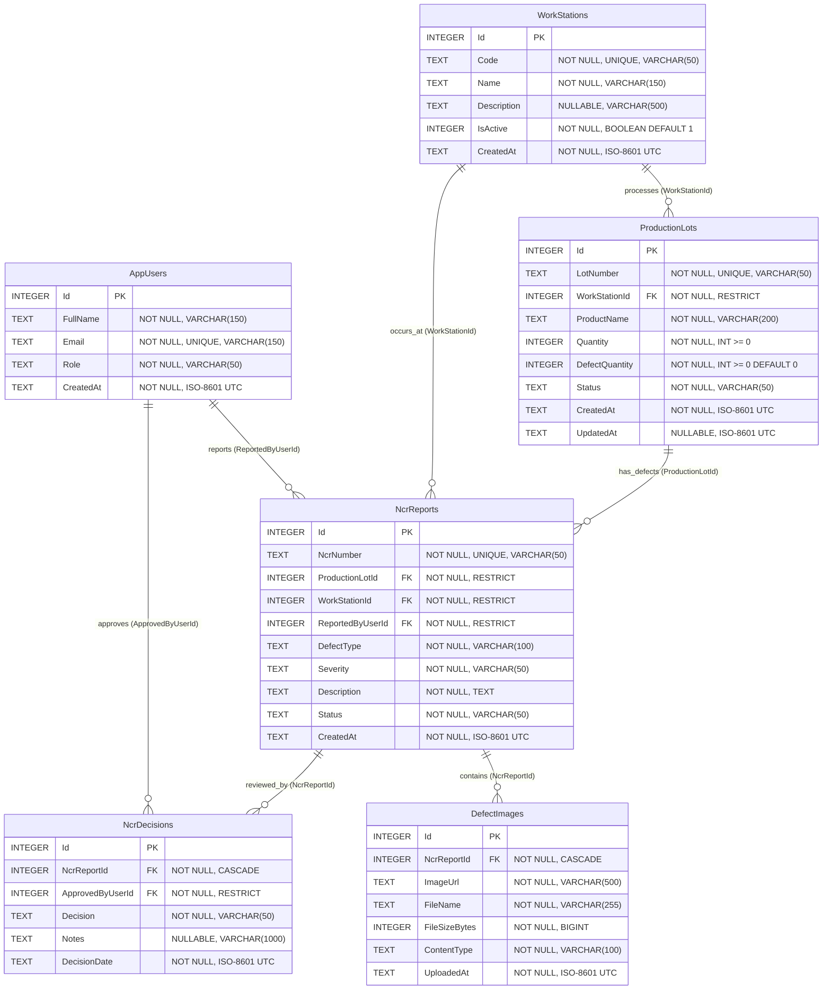
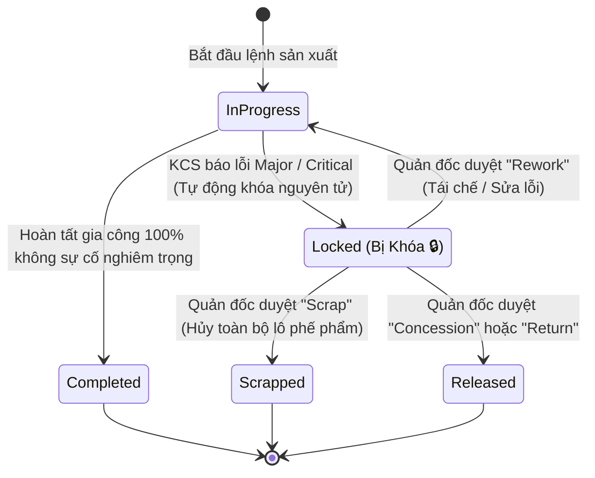
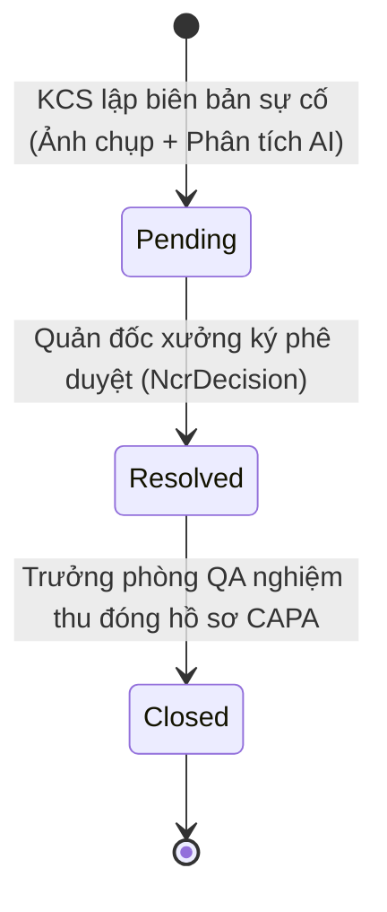

# KCS-SmartFactory OS — Architectural Design Document (Sprint 1)

**Tài liệu:** Bản thiết kế kiến trúc hệ thống lõi & hợp đồng dữ liệu (Core Architecture & Data Contracts)  
**Phiên bản:** 1.0.0 (Release-Ready)  
**Tác giả:** `[📐 PLAN]` — Principal System Architect & Enterprise Technical Director  
**Dự án:** KCS-SmartFactory OS (.NET 10 / ASP.NET Core / EF Core SQLite WAL / SignalR Realtime)  
**Tiêu chuẩn áp dụng:** ISO 9001:2015 (Quality Management System - Control of Nonconforming Outputs) & RFC 7807 (Problem Details for HTTP APIs)

---

## 1. Tổng quan Kiến trúc Hệ thống (System Architecture Overview)

KCS-SmartFactory OS được xây dựng theo kiến trúc phân tầng dạng khối (Modular Monolith Layered Architecture) hướng nghiệp vụ sản xuất thông minh (Industry 4.0), tối ưu hóa luồng dữ liệu tức thì từ hiện trường xưởng máy đến ban quản đốc:

```
[ Hiện Trường: Mobile Web KCS / Web Camera ]
                    │
                    ▼ (HTTPS Multipart / JSON)
[ Controllers Layer (ASP.NET Core .NET 10) ]
   ├── NcrReportsController
   ├── NcrDecisionsController
   ├── DashboardController
   ├── ProductionLotsController
   └── WorkStationsController
                    │
                    ▼
[ Services Layer (Atomic Domain & Business Engine) ]
   ├── NcrService (Two-Phase Commit, Atomic Lot Locking)
   ├── AiInspectionService (Gemini 1.5 Flash Vision + Smart Heuristic Fallback)
   ├── DashboardService (Pareto 80/20 Distribution Calculation)
   └── FileStorageService (Binary Magic Bytes, Anti-Path Traversal)
                    │
         ┌──────────┴──────────┐
         ▼                     ▼
[ Realtime Hub (SignalR) ]   [ EF Core Repositories & Unit of Work ]
   └── /hubs/factory            ├── ProductionLotRepository
                                ├── NcrReportRepository
                                ├── WorkStationRepository
                                ├── AppUserRepository
                                └── DashboardRepository
                                       │
                                       ▼
                             [ SQLite WAL Mode Database Engine ]
                             (smartfactory.db | WAL + BusyTimeout 5000ms)
```

---

## 2. Thiết kế Cơ sở Dữ liệu 6 Bảng (Entity-Relationship Design)

Hệ thống được chuẩn hóa toàn vẹn dữ liệu với 6 bảng cốt lõi phục vụ quy trình kiểm soát chất lượng chuẩn ISO 9001:

1. `AppUsers`: Lưu trữ danh tính, vai trò công nhân KCS, Quản đốc, Ban Giám đốc.
2. `WorkStations`: Danh mục trạm sản xuất thực tế trên chuyền máy.
3. `ProductionLots`: Thông tin lô sản xuất, số lượng, tỷ lệ phế phẩm và cờ trạng thái khóa chuyền.
4. `NcrReports`: Biên bản ghi nhận sự cố không phù hợp (Non-Conformance Report).
5. `DefectImages`: Lưu trữ metadata và đường dẫn vật lý của ảnh chụp khuyết tật hiện trường.
6. `NcrDecisions`: Quyết định phê duyệt xử lý sự cố của Quản đốc xưởng (Audit Trail).

### 2.1 Sơ đồ ERD Hoàn chỉnh (Mermaid ER Diagram)



### 2.2 Đặc tả Chi tiết Thuộc tính & Ràng buộc (Database Schema Specification)

#### Bảng `AppUsers`
| Tên Cột | Kiểu Dữ Liệu | Ràng Buộc | Ý Nghĩa / Giá Trị Mẫu |
| :--- | :--- | :--- | :--- |
| `Id` | INTEGER | PRIMARY KEY AUTOINCREMENT | Khóa chính định danh tài khoản |
| `FullName` | TEXT (150) | NOT NULL | Tên đầy đủ: *"Lê Thị KCS"* |
| `Email` | TEXT (150) | NOT NULL, UNIQUE INDEX | Email định danh: *"kcs@smartfactory.vn"* |
| `Role` | TEXT (50) | NOT NULL | Phân quyền: `Supervisor`, `KCS`, `Manager` |
| `CreatedAt` | TEXT | NOT NULL, DEFAULT (CURRENT_TIMESTAMP) | Thời điểm tạo tài khoản (UTC) |

#### Bảng `WorkStations`
| Tên Cột | Kiểu Dữ Liệu | Ràng Buộc | Ý Nghĩa / Giá Trị Mẫu |
| :--- | :--- | :--- | :--- |
| `Id` | INTEGER | PRIMARY KEY AUTOINCREMENT | Khóa chính định danh trạm máy |
| `Code` | TEXT (50) | NOT NULL, UNIQUE INDEX | Mã trạm: `ST-01`, `ST-02`, `ST-03` |
| `Name` | TEXT (150) | NOT NULL | Tên trạm: *"Trạm Cắt & Dập"* |
| `Description` | TEXT (500) | NULLABLE | Mô tả chức năng kỹ thuật |
| `IsActive` | INTEGER | NOT NULL, DEFAULT 1 | Cờ trạng thái hoạt động (1: Active, 0: Disabled) |
| `CreatedAt` | TEXT | NOT NULL, DEFAULT (CURRENT_TIMESTAMP) | Thời điểm thiết lập trạm máy |

#### Bảng `ProductionLots`
| Tên Cột | Kiểu Dữ Liệu | Ràng Buộc | Ý Nghĩa / Giá Trị Mẫu |
| :--- | :--- | :--- | :--- |
| `Id` | INTEGER | PRIMARY KEY AUTOINCREMENT | Khóa chính lô sản xuất |
| `LotNumber` | TEXT (50) | NOT NULL, UNIQUE INDEX | Mã lô: `LOT-2026-001` |
| `WorkStationId`| INTEGER | NOT NULL, FK -> `WorkStations(Id)` ON DELETE RESTRICT | Trạm đang gia công lô hàng |
| `ProductName` | TEXT (200) | NOT NULL | Tên thành phẩm: *"Vỏ Máy Biến Áp 250kVA"* |
| `Quantity` | INTEGER | NOT NULL, CHECK (Quantity >= 0) | Tổng sản lượng đăng ký sản xuất |
| `DefectQuantity`| INTEGER | NOT NULL, DEFAULT 0 | Tổng số sản phẩm lỗi tích lũy |
| `Status` | TEXT (50) | NOT NULL, DEFAULT 'InProgress' | `InProgress`, `Locked`, `Completed`, `Scrapped`, `Released` |
| `CreatedAt` | TEXT | NOT NULL, DEFAULT (CURRENT_TIMESTAMP) | Thời điểm bắt đầu lô |
| `UpdatedAt` | TEXT | NULLABLE | Thời điểm cập nhật trạng thái gần nhất |

#### Bảng `NcrReports`
| Tên Cột | Kiểu Dữ Liệu | Ràng Buộc | Ý Nghĩa / Giá Trị Mẫu |
| :--- | :--- | :--- | :--- |
| `Id` | INTEGER | PRIMARY KEY AUTOINCREMENT | Khóa chính biên bản sự cố |
| `NcrNumber` | TEXT (50) | NOT NULL, UNIQUE INDEX | Mã định danh biên bản: `NCR-20260923-A8F19C` |
| `ProductionLotId`| INTEGER | NOT NULL, FK -> `ProductionLots(Id)` ON DELETE RESTRICT | Lô hàng xảy ra sự cố |
| `WorkStationId`| INTEGER | NOT NULL, FK -> `WorkStations(Id)` ON DELETE RESTRICT | Trạm máy phát hiện lỗi |
| `ReportedByUserId`| INTEGER | NOT NULL, FK -> `AppUsers(Id)` ON DELETE RESTRICT | Nhân viên KCS lập biên bản |
| `DefectType` | TEXT (100) | NOT NULL | `Crack`, `Scratch`, `Deformation`, `MissingPart`, `Other` |
| `Severity` | TEXT (50) | NOT NULL, DEFAULT 'Minor' | `Minor`, `Major`, `Critical` |
| `Description` | TEXT | NOT NULL | Chi tiết mô tả lỗi & phân tích từ AI Vision |
| `Status` | TEXT (50) | NOT NULL, DEFAULT 'Pending' | Trạng thái biên bản: `Pending`, `Resolved`, `Closed` |
| `CreatedAt` | TEXT | NOT NULL, DEFAULT (CURRENT_TIMESTAMP) | Thời điểm KCS lập biên bản |

#### Bảng `DefectImages`
| Tên Cột | Kiểu Dữ Liệu | Ràng Buộc | Ý Nghĩa / Giá Trị Mẫu |
| :--- | :--- | :--- | :--- |
| `Id` | INTEGER | PRIMARY KEY AUTOINCREMENT | Khóa chính bản ghi ảnh |
| `NcrReportId` | INTEGER | NOT NULL, FK -> `NcrReports(Id)` ON DELETE CASCADE | Biên bản sở hữu ảnh |
| `ImageUrl` | TEXT (500) | NOT NULL | Đường dẫn truy cập HTTP: `/uploads/defects/uuid.jpg` |
| `FileName` | TEXT (255) | NOT NULL | Tên file gốc người dùng tải lên |
| `FileSizeBytes`| INTEGER | NOT NULL | Dung lượng file (bytes) |
| `ContentType` | TEXT (100) | NOT NULL | MIME Type: `image/jpeg`, `image/png`, `image/webp` |
| `UploadedAt` | TEXT | NOT NULL, DEFAULT (CURRENT_TIMESTAMP) | Thời điểm hoàn tất tải lên đĩa cứng |

#### Bảng `NcrDecisions`
| Tên Cột | Kiểu Dữ Liệu | Ràng Buộc | Ý Nghĩa / Giá Trị Mẫu |
| :--- | :--- | :--- | :--- |
| `Id` | INTEGER | PRIMARY KEY AUTOINCREMENT | Khóa chính quyết định phê duyệt |
| `NcrReportId` | INTEGER | NOT NULL, FK -> `NcrReports(Id)` ON DELETE CASCADE | Biên bản được phê duyệt |
| `ApprovedByUserId`| INTEGER | NOT NULL, FK -> `AppUsers(Id)` ON DELETE RESTRICT | Quản đốc phê duyệt |
| `Decision` | TEXT (50) | NOT NULL | Phương án xử lý: `Rework`, `Scrap`, `Concession`, `Return` |
| `Notes` | TEXT (1000)| NULLABLE | Chỉ đạo kỹ thuật khắc phục của Quản đốc |
| `DecisionDate` | TEXT | NOT NULL, DEFAULT (CURRENT_TIMESTAMP) | Thời điểm Quản đốc bấm xác nhận |

---

## 3. Thiết kế State Machine (Mô hình Máy Trạng thái)

Hệ thống quản lý chặt chẽ chu trình sống của hai đối tượng trung tâm: Lô hàng (`ProductionLot`) và Biên bản sự cố (`NcrReport`).

### 3.1 State Machine: `ProductionLot.Status`



#### Quy tắc Chuyển Đổi Trạng Thái `ProductionLot`:
1. **`InProgress` $\rightarrow$ `Locked`**:
   - *Điều kiện kích hoạt (Trigger):* API `POST /api/ncr-reports/inspect` gửi lên sự cố có `Severity = 'Major'` hoặc `'Critical'`.
   - *Tính chất:* Thực hiện nguyên tử (Atomic Database Transaction) cùng lúc với bản ghi `NcrReport`. Lập tức khóa chuyền để chặn công nhân xuất hàng.
2. **`Locked` $\rightarrow$ `InProgress`**:
   - *Điều kiện kích hoạt:* Quản đốc chọn phương án `Rework` (Tái chế/Gia công lại) tại `POST /api/ncr-decisions`.
   - *Ý nghĩa:* Cho phép trạm máy đưa sản phẩm vào sửa chữa hoặc tái kiểm tra.
3. **`Locked` $\rightarrow$ `Scrapped`**:
   - *Điều kiện kích hoạt:* Quản đốc chọn `Scrap` (Hủy bỏ hoàn toàn lô).
   - *Ý nghĩa:* Kết thúc vòng đời lô hàng thành phế liệu, cập nhật cảnh báo vào hệ thống ERP/Kho.
4. **`Locked` $\rightarrow$ `Released`**:
   - *Điều kiện kích hoạt:* Quản đốc chọn `Concession` (Đặc cách chấp nhận) hoặc `Return` (Trả vật tư cho NCC).
   - *Ý nghĩa:* Giải phóng lô hàng kèm biên bản cam kết chất lượng.

---

### 3.2 State Machine: `NcrReport.Status`



#### Quy tắc Chuyển Đổi Trạng Thái `NcrReport`:
1. **`Pending` (Chờ xử lý):** Khởi tạo mặc định khi KCS gửi báo cáo. Tại trạng thái này, biên bản mở, cho phép Quản đốc thẩm định hiện trường và kết quả phân tích AI.
2. **`Resolved` (Đã xử lý):** Chuyển đổi khi Quản đốc thực hiện phê duyệt phương án (Rework, Scrap, Concession, Return).
   - *Bảo vệ Idempotency:* Biên bản đã `Resolved` KHÔNG cho phép phê duyệt lại để ngăn chặn tình trạng ghi đè quyết định (Race Condition).
3. **`Closed` (Đã đóng hồ sơ):** Đại diện cho giai đoạn hậu kiểm (CAPA: Corrective And Preventive Action), lưu trữ vĩnh viễn phục vụ đánh giá định kỳ ISO 9001.

---

## 4. Đặc tả Hợp đồng Dữ liệu (Data Contracts & API Specifications)

Toàn bộ API tuân thủ tiêu chuẩn RESTful, trả về mã trạng thái HTTP chuẩn mực và định dạng lỗi theo chuẩn quốc tế RFC 7807 (ProblemDetails).

### 4.1 Endpoint 1: KCS Báo Lỗi Hiện Trường
- **Phương thức & URL:** `POST /api/ncr-reports/inspect`
- **Mã hóa:** `multipart/form-data`
- **Quyền hạn:** `KCS`, `Supervisor`, `Manager`

#### Request Contract:
```csharp
public class NcrInspectionRequest
{
    [Required(ErrorMessage = "Mã lô sản xuất là bắt buộc.")]
    [Range(1, int.MaxValue, ErrorMessage = "LotId không hợp lệ.")]
    public int LotId { get; set; }

    [Required(ErrorMessage = "Trạm máy là bắt buộc.")]
    [Range(1, int.MaxValue, ErrorMessage = "StationId không hợp lệ.")]
    public int StationId { get; set; }

    [Required(ErrorMessage = "Người báo cáo là bắt buộc.")]
    [Range(1, int.MaxValue, ErrorMessage = "ReportedByUserId không hợp lệ.")]
    public int ReportedByUserId { get; set; }

    [Required(ErrorMessage = "Loại lỗi là bắt buộc.")]
    [StringLength(100, ErrorMessage = "Loại lỗi không được vượt quá 100 ký tự.")]
    public string DefectType { get; set; } = string.Empty; // Crack, Scratch, Deformation, MissingPart, Other, Auto

    [Required(ErrorMessage = "Mức độ nghiêm trọng là bắt buộc.")]
    [RegularExpression("^(Minor|Major|Critical)$", ErrorMessage = "Severity chỉ chấp nhận: Minor, Major, Critical.")]
    public string Severity { get; set; } = "Minor";

    [StringLength(2000, ErrorMessage = "Mô tả không được vượt quá 2000 ký tự.")]
    public string Description { get; set; } = string.Empty;

    public IFormFile? Image { get; set; }
}
```

#### Response Contract (201 Created):
```json
{
  "id": 14,
  "ncrNumber": "NCR-20260923-4E8A1B",
  "productionLotId": 1,
  "lotNumber": "LOT-2026-001",
  "lotStatus": "Locked",
  "workStationId": 1,
  "stationCode": "ST-01",
  "reportedByUserId": 2,
  "reportedByName": "Lê Thị KCS",
  "defectType": "Crack",
  "severity": "Critical",
  "description": "Nứt gãy chân đế kim loại (AI: Ứng suất dư nhiệt hoặc áp lực chấn dập vượt quá ngưỡng dẻo của hợp kim)",
  "status": "Pending",
  "createdAt": "2026-09-23T02:45:00.1234567Z",
  "imageUrls": [
    "/uploads/defects/b7102e3b8a1c4df8820c29b6ea17c381.jpg"
  ]
}
```

---

### 4.2 Endpoint 2: Quản Đốc Duyệt Biên Bản Sự Cố
- **Phương thức & URL:** `POST /api/ncr-decisions`
- **Mã hóa:** `application/json`
- **Quyền hạn:** `Supervisor`, `Manager`

#### Request Contract:
```csharp
public class NcrDecisionRequest
{
    [Required(ErrorMessage = "Mã biên bản NCR là bắt buộc.")]
    [Range(1, int.MaxValue, ErrorMessage = "NcrReportId không hợp lệ.")]
    public int NcrReportId { get; set; }

    [Required(ErrorMessage = "Quyết định xử lý là bắt buộc.")]
    [RegularExpression("^(Rework|Scrap|Concession|Return)$", ErrorMessage = "Quyết định phải là: Rework, Scrap, Concession, Return.")]
    public string Decision { get; set; } = string.Empty;

    [StringLength(1000, ErrorMessage = "Ghi chú không được vượt quá 1000 ký tự.")]
    public string? Notes { get; set; }

    [Required(ErrorMessage = "Người phê duyệt là bắt buộc.")]
    [Range(1, int.MaxValue, ErrorMessage = "ApprovedByUserId không hợp lệ.")]
    public int ApprovedByUserId { get; set; }
}
```

#### Response Contract (200 OK):
```json
{
  "id": 8,
  "ncrReportId": 14,
  "decision": "Rework",
  "notes": "Yêu cầu trạm ST-01 nắn chỉnh lại nhiệt độ ram và hàn sửa gia cường chân đế.",
  "approvedByUserId": 1,
  "approvedByName": "Trần Văn Quản Đốc",
  "decisionDate": "2026-09-23T03:00:15.9876543Z",
  "productionLotStatus": "InProgress",
  "ncrReportStatus": "Resolved"
}
```

---

### 4.3 Endpoint 3: Dashboard Phân Tích Pareto 80/20
- **Phương thức & URL:** `GET /api/dashboard/pareto`
- **Mã hóa:** `application/json`
- **Mô tả:** Trả về bảng tần suất phân phối các loại lỗi theo thứ tự giảm dần kèm tỷ lệ phần trăm tích lũy (Cumulative Percentage) để vẽ biểu đồ Pareto 80/20.

#### Response Contract (200 OK):
```json
{
  "totalDefects": 25,
  "items": [
    {
      "defectType": "Crack",
      "count": 12,
      "percentage": 48.0,
      "cumulativePercentage": 48.0
    },
    {
      "defectType": "Deformation",
      "count": 8,
      "percentage": 32.0,
      "cumulativePercentage": 80.0
    },
    {
      "defectType": "Scratch",
      "count": 3,
      "percentage": 12.0,
      "cumulativePercentage": 92.0
    },
    {
      "defectType": "MissingPart",
      "count": 2,
      "percentage": 8.0,
      "cumulativePercentage": 100.0
    }
  ]
}
```

---

## 5. Ma trận Xử lý Biên & Kịch bản Thử thách (Edge Cases Matrix)

Hệ thống được thiết kế với tư duy phòng thủ chiều sâu (Defense-in-Depth), xử lý triệt để 7 kịch bản biên nghiêm ngặt:

| STT | Kịch Bản Thử Thách (Scenario) | Dữ Liệu Đầu Vào / Hành Vi Kích Hoạt | Cơ Chế Phòng Thủ Kỹ Thuật | Phản Hồi HTTP & Dữ Liệu Trả Về | Tính Toàn Vẹn DB & File System |
| :---: | :--- | :--- | :--- | :--- | :--- |
| **1** | **Null / Empty / Missing Fields** | `LotId = 0`, `DefectType = ""`, `Severity = "INVALID"` | DataAnnotations Validation + Fluent Middleware Interceptor | `400 Bad Request` + RFC 7807 ProblemDetails chứa danh sách lỗi chi tiết từng trường | Không thay đổi dữ liệu DB. Không lưu file rác. |
| **2** | **File Size > 5MB (Quá khổ)** | Tải lên ảnh khuyết tật dung lượng `5,242,881 bytes` (~5.001 MB) | Kiểm tra `file.Length > 5 * 1024 * 1024` trước khi mở luồng ghi I/O | `413 Payload Too Large`: *"File size 5242881 bytes exceeds the maximum allowed limit of 5242880 bytes (5MB)."* | Từ chối ngay lập tức tại RAM, không tốn I/O đĩa cứng. |
| **3** | **Giả mạo File (Malicious Spoofing)** | Đổi tên `malware.exe` hoặc script `.sh` thành `defect.jpg` | Đọc 16 bytes đầu của Stream để kiểm tra **Magic Bytes**: Chặn `MZ` (0x4D 0x5A), chỉ chấp nhận `JPEG` (FF D8 FF), `PNG` (89 50 4E 47), `WEBP` (RIFF...WEBP) | `400 Bad Request`: *"Executable files (.exe) are strictly prohibited"* hoặc *"Invalid image format."* | File độc hại không bao giờ được ghi xuống thư mục `wwwroot/uploads`. |
| **4** | **Tranh chấp Đồng thời (Race Condition)** | Hai Quản đốc cùng bấm duyệt cùng một biên bản NCR tại cùng 1 mili-giây | Kết hợp `SemaphoreSlim(1,1)` trên bộ nhớ và kiểm tra trạng thái Idempotency `ncr.Status == "Resolved"` trong Transaction | Quản đốc 1 nhận `200 OK`. Quản đốc 2 nhận `409 Conflict`: *"NCR Report 'NCR-xxxx' has already been resolved."* | Tuyệt đối không sinh 2 bản ghi `NcrDecision` trùng lặp; bảo toàn trạng thái lô hàng. |
| **5** | **AI Vision Timeout / Gián đoạn Mạng** | Google Gemini Vision API bị nghẽn mạng hoặc mất kết nối quá 8 giây | `HttpClient.Timeout = 8s` kết hợp khối `try/catch` bọc ngoài, tự động kích hoạt **Smart Heuristic Fallback Engine** phân tích từ khóa hiện trường | `201 Created`: Biên bản vẫn được tạo thành công với `Severity = "Major"` (Fail-safe Locking) | Đảm bảo tính khả dụng 100%, không làm ngưng trệ quy trình sản xuất ngay cả khi mất mạng quốc tế. |
| **6** | **Sự cố Đĩa cứng / Lỗi Commit DB (Two-Phase Failure)** | File ảnh đã ghi xuống đĩa nhưng DB ném lỗi `DbUpdateConcurrencyException` | Mô hình **Two-Phase Compensating Cleanup**: Khối `catch` của Transaction tự động gọi `_fileStorageService.DeleteFile(savedImageUrl)` | `500 Internal Server Error` (hoặc rollback an toàn) | Không sinh file ảnh mồ côi (Orphan Files) làm rác bộ nhớ máy chủ. |
| **7** | **SQLite DB Lock / Concurrency Write** | Hàng loạt trạm máy gửi biên bản ghi đồng thời vào file `smartfactory.db` | Cấu hình chế độ **SQLite WAL (Write-Ahead Logging)** + `PRAGMA busy_timeout = 5000` + `EF Core ExecutionStrategy` tự động retry | Toàn bộ request được xếp hàng ghi mượt mà, không xảy ra lỗi `database is locked (5)` | Dữ liệu được ghi tuần tự vào file WAL với độ trễ dưới 15ms. |

---

## 6. Kiến trúc Mở rộng: Xuất Biên bản NCR Chuẩn ISO 9001 Dạng PDF (QuestPDF)

Để đáp ứng yêu cầu số hóa hoàn chỉnh quy trình ISO 9001:2015 Clause 8.7 (*Kiểm soát đầu ra không phù hợp*) và Clause 10.2 (*Sự không phù hợp và hành động khắc phục*), hệ thống tích hợp thư viện **QuestPDF** để xuất biên bản định dạng PDF chuẩn công nghiệp.

### 6.1 Tổng quan Thành phần & Vòng đời Xử lý
```
[ Client Request: GET /api/ncr-reports/{id}/export-pdf ]
                         │
                         ▼
           [ NcrReportsController.ExportPdf ]
                         │
                         ▼
              [ INcrPdfExportService ]
              (NcrPdfExportService)
                         │
        ┌────────────────┼────────────────┐
        ▼                ▼                ▼
[ Load Entity Data ] [ Read Image Stream ] [ Render QuestPDF Document ]
(NcrReport + Lot +   (From wwwroot or      (NcrIsoDocument : IDocument)
 Decisions + Users)   Fallback SVG badge)
                         │
                         ▼
               [ SkiaSharp Canvas ]
                         │
                         ▼ (Binary MemoryStream)
         [ HTTP 200 OK: application/pdf Stream ]
         (Content-Disposition: inline/attachment)
```

### 6.2 Cấu trúc Trang Tài liệu ISO 9001 (Document Layout Blueprint)
Biên bản được dàn trang trên khổ chuẩn **A4 (210mm x 297mm)**, căn lề 25pt, bao gồm 5 phân vùng tiêu chuẩn:
1. **Header Kiểm Soát Tài Liệu:** Logo nhà máy, Tiêu đề biên bản chuẩn ISO, Bảng mã biểu mẫu (`BM-QA-NCR-01`, `Rev 03`, `Ngày: 01/01/2026`).
2. **Bảng Thông Tin Tổng Quát:** Mã Lô sản xuất, Tên sản phẩm, Trạm máy phát hiện, Sản lượng, Số lượng phế phẩm, Mức độ nghiêm trọng (Hộp màu cảnh báo: Đỏ/Cam/Vàng).
3. **Minh Chứng Hiện Trường (Defect Image):** Khung ảnh màu độ phân giải cao có viền kỹ thuật, tự động scale theo tỷ lệ thực (Aspect Ratio), kèm nhãn thông số file và cơ chế Fallback nếu ảnh bị xóa.
4. **Phân Tích Nguyên Nhân Gốc Rễ (RCA):** Bảng phương pháp 5-Why / Ishikawa tóm lược, kết quả AI Vision Engine, độ tin cậy (`AiConfidence`) và biện pháp phòng ngừa tức thời.
5. **Quyết Định Xử Lý & Chữ Ký Số:** Phương án của Quản đốc (`Rework`, `Scrap`, `Concession`, `Return`), Ghi chú chỉ đạo, Chữ ký số KCS, Con dấu phê duyệt Quản đốc xưởng và mã QR truy xuất nguồn gốc.
6. **Footer Chân Trang:** Thông báo bảo mật tài liệu nội bộ ISO 9001 và đánh số trang động *"Trang X / Y"*.

---
*Bản thiết kế này đã được kiểm định và tuân thủ nguyên tắc Zero Placeholder (100% chi tiết kỹ thuật hoàn chỉnh).*  
*Sẵn sàng bàn giao cho các Agent kỹ thuật thi công và kiểm thử.*
