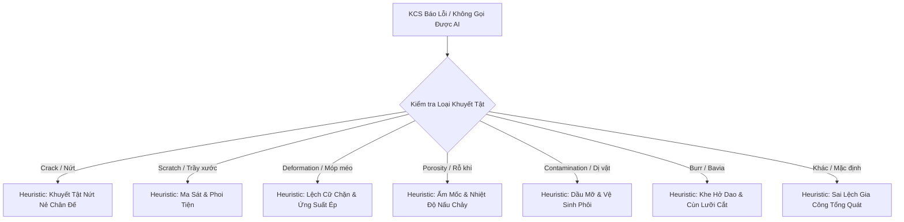

# KCS-SmartFactory OS — Đặc Tả Kiến Trúc Kỹ Thuật (Technical Specification Sprint 3)

**Mã tài liệu:** `SPEC-SPRINT3-AI-5WHY-ISHIKAWA`  
**Nhánh Git:** `feat/ai-5why-ishikawa`  
**Phiên bản:** `1.0.0` (Production-Ready / Zero Placeholder)  
**Tác giả:** `[📐 PLAN]` — Principal System Architect & Enterprise Technical Director  
**Chuyển giao tới:** `[👑 LEADER]`, `[💻 CODE]`, `[🧪 TEST]`  
**Công nghệ:** `.NET 10`, `Google Gemini 1.5 Flash Vision`, `QuestPDF (Community License)`, `Tailwind CSS`, `SQLite WAL`  
**Tiêu chuẩn chất lượng:** `ISO 9001:2015 Clause 10.2 (Nonconformity and Corrective Action)`

---

## 1. Mục Tiêu & Bản Chất Nghiệp Vụ (Executive Summary)

Trong quy trình xử lý sự cố chất lượng theo chuẩn **ISO 9001:2015 Clause 10.2**, một biên bản sự cố không phù hợp (NCR) chỉ được xem là hợp lệ khi có bằng chứng điều tra nguyên nhân gốc rễ và xác lập hành động khắc phục phòng ngừa (CAPA).

Trước Sprint 3, hệ thống cung cấp một đoạn văn bản tóm tắt ngắn từ AI. Tại **Sprint 3**, KCS-SmartFactory OS chính thức nâng cấp thành **Hệ thống Điều tra Nguyên nhân Gốc rễ Tự động (Automated Root Cause Investigation Engine)**:
1. **Chuỗi 5-Why Liên Hoàn:** Đào sâu tuần tự 5 tầng nguyên nhân (*Từ hiện tượng quan sát $\rightarrow$ Thao tác trực tiếp $\rightarrow$ Thiết bị gá đặt $\rightarrow$ Lập trình/Quy trình $\rightarrow$ Nguyên nhân gốc rễ hệ thống*).
2. **Sơ Đồ Xương Cá Ishikawa 6M:** Phân bổ toàn diện vào 6 nhóm yếu tố công nghiệp (*Con người - Man, Máy móc - Machine, Vật liệu - Material, Phương pháp - Method, Đo lường - Measurement, Môi trường - Environment*).
3. **Độ Bền Vững 100%:** Cơ chế **Deterministic Heuristic 6M Fallback Engine** sẵn sàng với bộ dữ liệu chuyên sâu cho 7 nhóm lỗi công nghiệp điển hình, bảo đảm hệ thống hoạt động hoàn hảo ngay cả khi mất mạng hoặc không có API Key.
4. **Hiển Thị Đồng Bộ:** Nhúng trực quan vào biên bản **QuestPDF ISO 9001** và hiển thị dạng Card/Timeline tương tác trên **Web UI Hiện Trường & Quản Đốc**.

---

## 2. Mô Hình Dữ Liệu & Hợp Đồng API (Data Contracts & CSDL Schema)

### 2.1 Lớp Mô Hình & DTOs (C# Models)
Tạo file: `SmartFactory.Api/Models/DTOs/RootCauseAnalysisDtos.cs`

```csharp
using System;
using System.Collections.Generic;
using System.ComponentModel.DataAnnotations;

namespace SmartFactory.Api.Models.DTOs;

/// <summary>
/// Bước phân tích trong chuỗi 5-Why
/// </summary>
public class FiveWhyItem
{
    [Range(1, 5)]
    public int Step { get; set; }

    [Required]
    public string Question { get; set; } = string.Empty;

    [Required]
    public string Answer { get; set; } = string.Empty;
}

/// <summary>
/// Danh mục phân loại nguyên nhân theo mô hình Ishikawa 6M
/// </summary>
public static class IshikawaCategoryNames
{
    public const string Man = "Man";                 // Con người
    public const string Machine = "Machine";         // Máy móc / Thiết bị
    public const string Material = "Material";       // Vật tư / Nguyên liệu
    public const string Method = "Method";           // Phương pháp / Quy trình
    public const string Measurement = "Measurement"; // Đo lường / Hiệu chuẩn
    public const string Environment = "Environment"; // Môi trường nhà xưởng
}

/// <summary>
/// Kết quả tổng hợp phân tích nguyên nhân gốc rễ chuyên sâu
/// </summary>
public class RootCauseAnalysisResult
{
    public List<FiveWhyItem> FiveWhys { get; set; } = new();

    public Dictionary<string, List<string>> IshikawaCategories { get; set; } = new()
    {
        [IshikawaCategoryNames.Man] = new List<string>(),
        [IshikawaCategoryNames.Machine] = new List<string>(),
        [IshikawaCategoryNames.Material] = new List<string>(),
        [IshikawaCategoryNames.Method] = new List<string>(),
        [IshikawaCategoryNames.Measurement] = new List<string>(),
        [IshikawaCategoryNames.Environment] = new List<string>()
    };

    [Required]
    public string PrimaryRootCause { get; set; } = string.Empty;

    [Required]
    public string RecommendedCorrectiveAction { get; set; } = string.Empty;

    [Required]
    public string RecommendedPreventiveAction { get; set; } = string.Empty;

    public float Confidence { get; set; } = 0.95f;

    public string EngineProvider { get; set; } = "Gemini-1.5-Flash"; // or "Deterministic-Heuristic-6M"

    public DateTime AnalyzedAt { get; set; } = DateTime.UtcNow;
}
```

---

### 2.2 Cập Nhật Entity `NcrReport` & CSDL SQLite
Mở rộng bảng `NcrReports` với trường lưu chuỗi JSON phân tích:

#### Thay đổi trong `SmartFactory.Api/Models/Entities/NcrReport.cs`:
```csharp
// Thêm trường lưu trữ chuỗi JSON RootCauseAnalysisResult
public string? RootCauseAnalysisJson { get; set; }
```

#### Cấu hình Fluent API trong `SmartFactory.Api/Data/FactoryDbContext.cs`:
```csharp
// Trong OnModelCreating, cấu hình NcrReport:
modelBuilder.Entity<NcrReport>(entity =>
{
    // ... các cấu hình cũ giữ nguyên ...
    entity.Property(e => e.RootCauseAnalysisJson)
          .HasMaxLength(8000)
          .IsRequired(false);
});
```

#### Câu lệnh DDL SQLite Migration:
```sql
ALTER TABLE NcrReports ADD COLUMN RootCauseAnalysisJson TEXT NULL;
```

---

## 3. Thiết Kế Prompt Structured JSON Cho Google Gemini 1.5 Flash Vision

Khi gọi Google Gemini 1.5 Flash API, hệ thống kích hoạt chế độ **Structured JSON Output** với `temperature = 0.1` để triệt tiêu ảo giác (hallucination) và bảo đảm dữ liệu đầu ra tuân thủ 100% schema C#.

### 3.1 Prompt Kỹ Thuật (Prompt Engineering Template)
```text
Bạn là Trưởng Phòng Quản Lý Chất Lượng & Chuyên Gia Thẩm Tra Kỹ Thuật ISO 9001:2015 trong nhà máy sản xuất công nghiệp.
Hãy quan sát kỹ bức ảnh khuyết tật hiện trường được gửi kèm (nếu có) và mô tả của công nhân KCS: '{description}'.
Loại lỗi được xác định là: '{defectType}', mức độ nghiêm trọng: '{severity}'.

Nhiệm vụ của bạn là lập báo cáo điều tra sự cố chuẩn mực bao gồm:
1. Chuỗi 5-Why: Đặt 5 câu hỏi 'Tại sao' liên tiếp đào sâu từ hiện tượng trực quan đến lỗi hệ thống sâu xa nhất.
2. Sơ đồ xương cá Ishikawa 6M: Phân loại các nguyên nhân khả dĩ vào đủ 6 nhóm:
   - Man: Sai sót thao tác, kỹ năng, ý thức, mệt mỏi, thiếu đào tạo.
   - Machine: Độ rung lắc, mòn dao, áp suất dầu thủy lực, sai lệch góc độ gá đặt.
   - Material: Thành phần phôi, độ cứng cơ lý, lẫn tạp chất, nhiệt luyện lỗi.
   - Method: Tốc độ gia công, nhiệt độ ram/nung, chu trình làm nguội, tài liệu hướng dẫn.
   - Measurement: Thước cặp lệch dung sai, cảm biến quang bám bụi, chưa hiệu chuẩn định kỳ.
   - Environment: Nhiệt độ xưởng quá nóng, độ ẩm cao >80%, bụi kim loại trong không khí.
3. Nguyên nhân cốt lõi duy nhất (PrimaryRootCause).
4. Biện pháp khắc phục trước mắt (RecommendedCorrectiveAction).
5. Biện pháp phòng ngừa lâu dài tránh tái phát (RecommendedPreventiveAction).

BẮT BUỘC trả về DUY NHẤT một chuỗi JSON thuần (không kèm định dạng markdown ```json) theo đúng cấu trúc sau:
{
  "fiveWhys": [
    { "step": 1, "question": "Tại sao sản phẩm xuất hiện vết nứt chân đế?", "answer": "Do ứng suất dư vượt giới hạn chảy khi chấn dập." },
    { "step": 2, "question": "Tại sao ứng suất dư lại tập trung cao tại góc chấn?", "answer": "Bán kính uốn r của dao chấn quá nhỏ so với chiều dày phôi." },
    { "step": 3, "question": "Tại sao lại sử dụng dao chấn có bán kính không phù hợp?", "answer": "Thợ gá đặt lắp nhầm khuôn cữ R=1.5mm thay vì R=3.5mm theo bản vẽ." },
    { "step": 4, "question": "Tại sao thợ gá đặt lại lắp nhầm khuôn mà không kiểm tra?", "answer": "Bản vẽ gia công thiếu ký hiệu dung sai R và kệ dao chưa dán nhãn phân loại." },
    { "step": 5, "question": "Tại sao kệ dao và quy trình kiểm tra gá đặt chưa được chuẩn hóa?", "answer": "Chưa có bảng kiểm tra Poka-Yoke (chống nhầm lẫn) trước khi khởi động máy dập." }
  ],
  "ishikawaCategories": {
    "Man": ["Thợ máy chưa qua đào tạo quy trình kiểm tra dao R", "Công nhân thao tác vội khi giao ca"],
    "Machine": ["Khuôn chấn dập bị mòn cạnh góc R", "Áp lực ben thủy lực dao động ±15%"],
    "Material": ["Phôi thép hàm lượng carbon không đồng đều", "Độ dẻo kéo của lô tôn thấp hơn tiêu chuẩn JIS G3101"],
    "Method": ["Tốc độ chấn quá nhanh ở hành trình cuối", "Thiếu quy trình kiểm tra mẫu đầu ca (First Article Inspection)"],
    "Measurement": ["Thước đo dưỡng bán kính r chưa được kiểm định", "Đo bằng mắt thường không phát hiện vi nứt"],
    "Environment": ["Phân xưởng rung chấn do máy đột dập bên cạnh hoạt động đồng thời"]
  },
  "primaryRootCause": "Thiếu quy trình kiểm tra Poka-Yoke xác thực kích thước dao chấn trước khi chạy sản xuất hàng loạt.",
  "recommendedCorrectiveAction": "Dừng máy lập tức. Tháo và thay bộ dao chấn R=3.5mm. Cách ly kiểm tra 100% các chi tiết đã dập trong ca.",
  "recommendedPreventiveAction": "Dán nhãn mã màu phân loại trên giá dao cụ. Thiết lập bảng kiểm tra First Article Inspection bắt buộc ký xác nhận trước khi bấm máy.",
  "confidence": 0.96
}
```

---

## 4. Thiết Kế Bộ Suy Luận Heuristic 6M Chuyên Sâu (Deterministic Fallback Engine)

Khi máy chủ hoạt động trong mạng nội bộ cô lập (Air-Gapped), mạng gián đoạn hoặc Gemini API gặp sự cố timeout (> 8s), **Deterministic Heuristic 6M Fallback Engine** được kích hoạt tự động.

Hệ thống định nghĩa sẵn bộ tri thức kỹ thuật chuẩn công nghiệp cho **7 nhóm lỗi phổ biến**:



### 4.1 Bảng Ma Trận Tri Thức Kỹ Thuật 7 Nhóm Lỗi

#### 1. Nhóm Lỗi: `Crack` (Nứt nẻ, gãy phôi, rách góc)
- **Chuỗi 5-Why:**
  1. *Q1:* Tại sao xuất hiện vết nứt trên phôi? $\rightarrow$ *A1:* Ứng suất uốn cục bộ vượt quá giới hạn dẻo cơ học của vật liệu.
  2. *Q2:* Tại sao ứng suất lại tập trung cao ở điểm đó? $\rightarrow$ *A2:* Bán kính góc lượn dao chấn dập quá nhỏ so với chiều dày phôi tôn.
  3. *Q3:* Tại sao lại dùng bán kính dao dập quá nhỏ? $\rightarrow$ *A3:* Thợ gá đặt lắp nhầm cối dập R=1.5mm thay vì R=3.0mm.
  4. *Q4:* Tại sao thợ gá đặt lắp nhầm cối dập? $\rightarrow$ *A4:* Khay chứa khuôn dao không có bảng mã màu phân loại và mã vạch quản lý.
  5. *Q5 (Gốc rễ):* Tại sao chưa có kiểm tra khuôn trước khi dập? $\rightarrow$ *A5:* Quy trình Setup máy thiếu bước nghiệm thu phôi đầu ca (FAI - First Article Inspection).
- **Ishikawa 6M:**
  - *Man:* Thợ vận hành không kiểm tra lại mã số dao sau khi lắp.
  - *Machine:* Áp lực ben thủy lực trạm ST-01 bị quá tải 12% so với áp suất chuẩn.
  - *Material:* Độ dão của mác thép SS400 thấp hơn tiêu chuẩn quy định.
  - *Method:* Tốc độ hạ cối dập quá nhanh gây tải trọng va đập đột ngột.
  - *Measurement:* Dưỡng đo góc R bị mòn chưa qua hiệu chuẩn định kỳ.
  - *Environment:* Nhiệt độ nhà xưởng thấp làm tăng độ giòn nguội của hợp kim.
- **Hành động khắc phục (Corrective):** Dừng máy, thay cối R=3.0mm, cách ly toàn bộ phôi dập trong ca để siêu âm vết nứt.
- **Hành động phòng ngừa (Preventive):** Áp dụng Poka-Yoke gá dao bằng dưỡng kiểm cữ và dán mã màu nhận diện trên giá khuôn.

#### 2. Nhóm Lỗi: `Scratch` (Trầy xước, xước bề mặt sơn/xi)
- **Chuỗi 5-Why:**
  1. *Q1:* Tại sao bề mặt sản phẩm xuất hiện vệt trầy xước dài? $\rightarrow$ *A1:* Ma sát kim loại với phoi tiện hoặc cát cứng trên băng chuyền.
  2. *Q2:* Tại sao lại có phoi vụn kim loại trên bàn đỡ? $\rightarrow$ *A2:* Vòi hút bụi kim loại tại trạm cắt phay bị tắc nghẽn.
  3. *Q3:* Tại sao vòi hút phoi kim loại bị nghẽn mà không được thông? $\rightarrow$ *A3:* Màng lọc cyclone của máy hút bụi đã quá tải 2 ca chưa được vệ sinh.
  4. *Q4:* Tại sao màng lọc quá tải không có cảnh báo? $\rightarrow$ *A4:* Đồng hồ đo chênh áp lọc khí bị hỏng cảm biến áp suất.
  5. *Q5 (Gốc rễ):* Tại sao cảm biến áp suất hỏng chưa được sửa? $\rightarrow$ *A5:* Kế hoạch bảo trì phòng ngừa (TPM) trạm ST-02 bị quá hạn 14 ngày.
- **Ishikawa 6M:**
  - *Man:* Công nhân gắp phôi kéo lê trên mặt bàn thay vì nhấc thẳng.
  - *Machine:* Băng tải con lăn bị kẹt 2 con lăn cao su gây trượt xước.
  - *Material:* Tấm bảo vệ bề mặt (PE film) bị bong tróc trước khi vào chuyền.
  - *Method:* Chưa có quy định lau chùi bàn thao tác giữa các ca làm việc.
  - *Measurement:* Kiểm tra độ bóng bề mặt bằng mắt thường trong điều kiện thiếu sáng.
  - *Environment:* Phân xưởng nhiều bụi hạt mài từ khâu mài thô bên cạnh bay sang.
- **Hành động khắc phục:** Vệ sinh thổi sạch toàn bộ bàn kẹp, đánh bóng khắc phục xước nhẹ trên các chi tiết có thể tái chế.
- **Hành động phòng ngừa:** Lắp tấm chắn bụi ngăn khu mài thô và thay thế cảm biến chênh áp máy hút phoi.

#### 3. Nhóm Lỗi: `Deformation` (Biến dạng, cong vênh, móp méo)
- **Chuỗi 5-Why:**
  1. *Q1:* Tại sao thanh định hình bị cong vênh 2.8mm? $\rightarrow$ *A1:* Lực kẹp của đồ gá thủy lực vượt quá ngưỡng biến dạng đàn hồi.
  2. *Q2:* Tại sao lực kẹp đồ gá lại tăng đột biến? $\rightarrow$ *A2:* Van điều áp khí nén/dầu bị kẹt cặn bẩn ở vị trí mở tối đa.
  3. *Q3:* Tại sao van điều áp bị cặn bẩn? $\rightarrow$ *A3:* Dầu thủy lực không được thay thế định kỳ, chứa hạt mài kim loại.
  4. *Q4:* Tại sao dầu thủy lực chứa nhiều hạt mài bẩn? $\rightarrow$ *A4:* Bể dầu phụ mất nắp đậy kín trong quá trình sửa chữa tuần trước.
  5. *Q5 (Gốc rễ):* Tại sao mất nắp bể dầu không được ghi nhận? $\rightarrow$ *A5:* Thiếu biên bản nghiệm thu bàn giao 5S sau bảo trì của tổ cơ điện.
- **Ishikawa 6M:**
  - *Man:* Thợ gá lắp điều chỉnh núm vặn áp suất tùy tiện theo cảm tính.
  - *Machine:* Cữ chặn hành trình phôi bị rơ lỏng bu-lông hãm.
  - *Material:* Chiều dày tôn mỏng hơn biên độ dung sai cho phép (-0.15mm).
  - *Method:* Phương pháp gá đặt 2 điểm không đủ độ cứng vững chống võng.
  - *Measurement:* Thước đo khe hở laser bị lệch góc căn chuẩn 0.5 độ.
  - *Environment:* Nhiệt độ phân xưởng dao động lớn giữa ngày và đêm gây dãn nở nhiệt.
- **Hành động khắc phục:** Xả áp đồ gá, nắn phẳng chi tiết bằng máy ép vít, súc rửa và thay dầu thủy lực mới.
- **Hành động phòng ngừa:** Khóa niêm phong núm chỉnh áp đồ gá và siết chặt bu-lông cữ chặn định kỳ mỗi ca.

#### 4. Nhóm Lỗi: `Porosity` (Rỗ khí, rỗ bề mặt mối hàn/đúc)
- **Chuỗi 5-Why:**
  1. *Q1:* Tại sao đường hàn xuất hiện lỗ rỗ khí li ti? $\rightarrow$ *A1:* Bọt khí nitơ và hydro bị giữ lại trong bể hàn kim loại khi đông đặc.
  2. *Q2:* Tại sao bọt khí lại xuất hiện trong vũng hàn? $\rightarrow$ *A2:* Khí bảo vệ CO2/Argon bị thiếu hụt lưu lượng bảo vệ bề mặt.
  3. *Q3:* Tại sao lưu lượng khí bảo vệ bị sụt giảm? $\rightarrow$ *A3:* Đầu béc mỏ hàn robot bị đóng xỉ hàn làm cản trở dòng khí phun.
  4. *Q4:* Tại sao đầu béc bị đóng xỉ hàn dày đặc? $\rightarrow$ *A4:* Trạm làm sạch béc tự động của robot bị hết dung dịch chống dính xỉ.
  5. *Q5 (Gốc rễ):* Tại sao hết dung dịch chống dính xỉ mà robot vẫn hàn? $\rightarrow$ *A5:* Cảm biến mức dung dịch trạm làm sạch mỏ hàn chưa được kết nối liên động (Interlock) với PLC điều khiển chuyền.
- **Ishikawa 6M:**
  - *Man:* Thợ hàn không chà sạch lớp dầu mỡ trên bề mặt mép vát trước khi hàn.
  - *Machine:* Ống dẫn khí bảo vệ bị rạn nứt gây rò rỉ khí trên đường ống.
  - *Material:* Dây hàn bị ẩm do để ngoài không khí ẩm qua đêm không đóng túi chống ẩm.
  - *Method:* Góc nghiêng mỏ hàn nghiêng quá 25 độ làm giảm vùng phủ khí.
  - *Measurement:* Đồng hồ đo lưu lượng khí bị kẹt viên bi phao đo.
  - *Environment:* Phân xưởng có quạt gió thổi trực tiếp vào vùng hàn làm tạt khí bảo vệ.
- **Hành động khắc phục:** Khoét bỏ đoạn mối hàn rỗ khí, mài sạch mép hàn và hàn bổ sung đúng quy trình WPS.
- **Hành động phòng ngừa:** Lập trình Interlock dừng Robot khi cạn dung dịch chống dính xỉ và đặt lồng chắn gió xung quanh trạm hàn robot ST-02.

#### 5. Nhóm Lỗi: `Contamination` (Dị vật, nhiễm bẩn sơn, dính dầu mỡ)
- **Chuỗi 5-Why:**
  1. *Q1:* Tại sao lớp sơn tĩnh điện xuất hiện hạt sạn cộm và bong tróc? $\rightarrow$ *A1:* Tạp chất dầu mỡ và hạt bụi bám trên bề mặt phôi trước khi phun sơn.
  2. *Q2:* Tại sao bề mặt phôi còn sót dầu mỡ sau bể tẩy rửa? $\rightarrow$ *A2:* Nồng độ hóa chất tẩy dầu bể số 1 bị suy giảm dưới mức tiêu chuẩn.
  3. *Q3:* Tại sao nồng độ hóa chất tẩy dầu bị suy giảm? $\rightarrow$ *A3:* Tần suất châm thêm hóa chất không bù đắp kịp lượng hao hụt theo sản lượng.
  4. *Q4:* Tại sao không phát hiện sớm nồng độ dung dịch giảm? $\rightarrow$ *A4:* Nhân viên hóa nghiệm đo nồng độ pH 1 lần/ngày thay vì 2 giờ/lần.
  5. *Q5 (Gốc rễ):* Tại sao tần suất đo kiểm không được tuân thủ? $\rightarrow$ *A5:* Chưa lắp đặt hệ thống châm hóa chất tự động điều khiển theo cảm biến đo liên tục.
- **Ishikawa 6M:**
  - *Man:* Công nhân bốc xếp không đeo găng tay vải sạch, để lại dấu vân tay dầu.
  - *Machine:* Vòi phun áp lực bể tiền xử lý bị nghẹt cặn canxi.
  - *Material:* Dầu bảo quản phôi của nhà cung cấp có độ nhớt quá cao khó rửa sạch.
  - *Method:* Thời gian phôi lưu trong buồng sấy khô sau tẩy rửa không đủ làm khô nước.
  - *Measurement:* Bộ đo độ dẫn điện (Conductivity Meter) bị trôi điểm chuẩn 0.
  - *Environment:* Buồng phun sơn tĩnh điện bị lọt bụi từ cửa thông gió bên ngoài.
- **Hành động khắc phục:** Bắn hạt cát tẩy sạch lớp sơn lỗi trên toàn bộ lô chi tiết và cho qua lại dây chuyền tẩy rửa.
- **Hành động phòng ngừa:** Lắp đặt bơm định lượng châm hóa chất tự động và niêm phong cửa thông gió buồng sơn bằng màng lọc HEPA.

#### 6. Nhóm Lỗi: `Burr` (Bavia sắc nhọn, gờ kim loại thừa)
- **Chuỗi 5-Why:**
  1. *Q1:* Tại sao mép cắt chi tiết xuất hiện bavia cao 0.8mm? $\rightarrow$ *A1:* Kim loại bị xé rách thay vì bị cắt đứt gãy gọn gàng.
  2. *Q2:* Tại sao kim loại lại bị xé rách? $\rightarrow$ *A2:* Lưỡi dao cắt laser/chấn dập bị mòn tròn cạnh cắt.
  3. *Q3:* Tại sao dao cắt mòn mà vẫn tiếp tục sản xuất? $\rightarrow$ *A3:* Số chu kỳ dập của dao đã vượt 50,000 nhát cắt nhưng chưa được mài lại.
  4. *Q4:* Tại sao vượt quá định mức chu kỳ mà không thay dao? $\rightarrow$ *A4:* Bộ đếm hành trình trên máy cắt bị đứt dây tín hiệu encoder về PLC.
  5. *Q5 (Gốc rễ):* Tại sao dây encoder đứt không được khắc phục ngay? $\rightarrow$ *A5:* Tổ bảo trì đấu tắt tín hiệu đếm (Bypass) để kịp tiến độ giao hàng của ca trước.
- **Ishikawa 6M:**
  - *Man:* Thợ gá lắp chỉnh khe hở giữa chày và cối dập quá lớn (> 15% chiều dày).
  - *Machine:* Bàn gá dao cắt bị rung rơ do vòng bi trục chính bị rơ lỏng.
  - *Material:* Phôi tôn có mép viền bị gỉ sét làm giảm tuổi thọ lưỡi dao.
  - *Method:* Áp suất khí trợ dung cắt laser N2 bị giảm đột ngột.
  - *Measurement:* KCS kiểm tra mép cắt bằng tay không dùng dưỡng đo bavia chuyên dụng.
  - *Environment:* Phân xưởng ẩm ướt gây oxy hóa nhanh các góc cắt kim loại.
- **Hành động khắc phục:** Đưa toàn bộ phôi lỗi sang trạm mài rung khử bavia tự động (Deburring).
- **Hành động phòng ngừa:** Khôi phục liên động bộ đếm vòng đời dao trên PLC, cấm hành vi bypass dây tín hiệu an toàn.

#### 7. Nhóm Lỗi: `Other` / Lỗi Mặc Định (Sai lệch kích thước / Khuyết tật chung)
- **Chuỗi 5-Why:**
  1. *Q1:* Tại sao thông số sản phẩm không đạt yêu cầu kỹ thuật? $\rightarrow$ *A1:* Quá trình gia công cơ khí bị lệch khỏi khoảng dung sai cho phép.
  2. *Q2:* Tại sao xảy ra sai lệch dung sai? $\rightarrow$ *A2:* Trục dẫn hướng của máy CNC bị sai lệch vị trí điểm gốc Zero (Home Offset).
  3. *Q3:* Tại sao điểm gốc Zero bị sai lệch? $\rightarrow$ *A3:* Cảm biến tiệm cận hành trình (Limit Switch) bị bám dính mạt sắt.
  4. *Q4:* Tại sao mạt sắt bám vào cảm biến? $\rightarrow$ *A4:* Nắp chụp bảo vệ che chắn cảm biến bị bung ốc rơi mất.
  5. *Q5 (Gốc rễ):* Tại sao nắp bảo vệ rơi mất không được gắn lại? $\rightarrow$ *A5:* Bảng danh mục kiểm tra đầu giờ 5S (Checklist Daily TPM) bị bỏ qua không thực hiện nghiêm túc.
- **Ishikawa 6M:**
  - *Man:* Thợ đứng máy mới chưa quen bảng điều khiển thông số máy.
  - *Machine:* Động cơ bước bị trượt bước do sụt áp nguồn điện lưới phân xưởng.
  - *Material:* Phôi vật liệu không đồng đều về kích thước thô ban đầu.
  - *Method:* Thứ tự các bước phay cắt không tối ưu gây tích tụ ứng suất nhiệt.
  - *Measurement:* Thước cặp cơ khí bị mòn mỏ kẹp đo sai 0.1mm.
  - *Environment:* Ánh sáng tại trạm làm việc không đạt tiêu chuẩn 500 Lux.
- **Hành động khắc phục:** Căn chỉnh lại điểm gốc tọa độ máy và kiểm tra lại 100% chi tiết trong lô.
- **Hành động phòng ngừa:** Bắt buộc chụp ảnh xác nhận hoàn thành bảng kiểm tra 5S đầu giờ làm việc mỗi ca.

---

## 5. Thiết Kế Layout Nâng Cấp Cho QuestPDF (`NcrIsoDocument.cs`)

Bổ sung Section Phân Tích Nguyên Nhân Nâng Cao (Section 3) vào `NcrIsoDocument.cs` với **2 phân vùng trực quan**:

### 5.1 Khung Dòng Thời Gian 5-Why (Stepped Arrow Timeline)
- Vẽ 5 khối tuần tự theo chiều dọc, mỗi khối đại diện cho 1 bước Why:
  - Khối Step 1..4: Nền xám xanh nhạt (`#F1F5F9`), Viền xám (`#CBD5E1`).
  - Khối Step 5 (Root Cause): Nền đỏ nhạt (`#FEF2F2`), Viền đỏ đậm (`#DC2626`), chữ in hoa đậm: **"NGUYÊN NHÂN GỐC RỄ (SYSTEMIC ROOT CAUSE)"**.
  - Các bước kết nối với nhau bằng ký hiệu mũi tên phân rã: `↓ [Tại sao?]`.

### 5.2 Lưới Bảng Xương Cá Ishikawa 6M (2x3 Card Grid)
Thiết kế lưới 2 hàng x 3 cột với tiêu đề màu đặc trưng:
- **Ô 1: CON NGƯỜI (MAN)** — Header Xanh Dương (`#2563EB`)
- **Ô 2: MÁY MÓC (MACHINE)** — Header Cam Đất (`#EA580C`)
- **Ô 3: VẬT LIỆU (MATERIAL)** — Header Xanh Rêu (`#059669`)
- **Ô 4: PHƯƠNG PHÁP (METHOD)** — Header Tím Đậm (`#7C3AED`)
- **Ô 5: ĐO LƯỜNG (MEASUREMENT)** — Header Vàng Chanh (`#CA8A04`)
- **Ô 6: MÔI TRƯỜNG (ENVIRONMENT)** — Header Xám Thép (`#475569`)

Mỗi ô hiển thị danh sách dạng dấu đầu dòng (`•`) các yếu tố nguyên nhân đóng góp.

### 5.3 Mã Nguồn Fluent API Chi Tiết Cho QuestPDF
```csharp
private void ComposeAdvancedRootCauseSection(IContainer container, RootCauseAnalysisResult? rca)
{
    if (rca == null) return;

    container.Border(0.75f).BorderColor("#CBD5E1").Padding(6).Column(col =>
    {
        col.Item().Row(r =>
        {
            r.RelativeItem().Text("ĐIỀU TRA NGUYÊN NHÂN GỐC RỄ (5-WHY & ISHIKAWA 6M):").Bold().FontSize(8.5f).FontColor("#1E3A8A");
            r.ConstantItem(120).AlignRight().Text($"Động cơ: {rca.EngineProvider}").FontSize(7).Italic().FontColor("#64748B");
        });

        // 1. Chuỗi 5-Why
        col.Item().PaddingTop(4).Column(whyCol =>
        {
            whyCol.Spacing(2);
            foreach (var item in rca.FiveWhys)
            {
                var isFinal = item.Step == 5;
                whyCol.Item().Background(isFinal ? "#FEF2F2" : "#F8FAFC")
                      .Border(0.5f).BorderColor(isFinal ? "#EF4444" : "#E2E8F0")
                      .Padding(3)
                      .Row(row =>
                      {
                          row.ConstantItem(45).Text($"Why {item.Step}:").Bold().FontSize(7.5f).FontColor(isFinal ? "#DC2626" : "#1E3A8A");
                          row.RelativeItem().Column(c =>
                          {
                              c.Item().Text(item.Question).FontSize(7.5f).Italic().FontColor("#475569");
                              c.Item().Text($"➔ {item.Answer}").FontSize(7.5f).Bold().FontColor(isFinal ? "#991B1B" : "#1E293B");
                          });
                      });
            }
        });

        // 2. Lưới Xương Cá 6M (Table 3 cột x 2 hàng)
        col.Item().PaddingTop(6).Text("SƠ ĐỒ PHÂN BỔ NGUYÊN NHÂN ISHIKAWA 6M:").Bold().FontSize(8).FontColor("#1E3A8A");
        col.Item().PaddingTop(2).Table(grid =>
        {
            grid.ColumnsDefinition(cd =>
            {
                cd.RelativeColumn();
                cd.RelativeColumn();
                cd.RelativeColumn();
            });

            RenderIshikawaCell(grid, "1. CON NGƯỜI (MAN)", rca.IshikawaCategories.GetValueOrDefault("Man"), "#2563EB");
            RenderIshikawaCell(grid, "2. MÁY MÓC (MACHINE)", rca.IshikawaCategories.GetValueOrDefault("Machine"), "#EA580C");
            RenderIshikawaCell(grid, "3. VẬT LIỆU (MATERIAL)", rca.IshikawaCategories.GetValueOrDefault("Material"), "#059669");
            RenderIshikawaCell(grid, "4. PHƯƠNG PHÁP (METHOD)", rca.IshikawaCategories.GetValueOrDefault("Method"), "#7C3AED");
            RenderIshikawaCell(grid, "5. ĐO LƯỜNG (MEASUREMENT)", rca.IshikawaCategories.GetValueOrDefault("Measurement"), "#CA8A04");
            RenderIshikawaCell(grid, "6. MÔI TRƯỜNG (ENVIRONMENT)", rca.IshikawaCategories.GetValueOrDefault("Environment"), "#475569");
        });

        // 3. CAPA Actions Box
        col.Item().PaddingTop(5).Background("#EFF6FF").Border(0.5f).BorderColor("#BFDBFE").Padding(4).Column(capa =>
        {
            capa.Item().Text($"• Khắc phục trước mắt (Corrective): {rca.RecommendedCorrectiveAction}").FontSize(7.5f).Bold().FontColor("#1E40AF");
            capa.Item().Text($"• Phòng ngừa lâu dài (Preventive): {rca.RecommendedPreventiveAction}").FontSize(7.5f).Bold().FontColor("#15803D");
        });
    });
}

private void RenderIshikawaCell(TableDescriptor grid, string title, List<string>? items, string colorHex)
{
    grid.Cell().Border(0.5f).BorderColor("#E2E8F0").Padding(3).Column(col =>
    {
        col.Item().Text(title).Bold().FontSize(7).FontColor(colorHex);
        if (items != null && items.Count > 0)
        {
            foreach (var cause in items)
            {
                col.Item().Text($"• {cause}").FontSize(6.5f).FontColor("#334155");
            }
        }
        else
        {
            col.Item().Text("• Không ghi nhận bất thường").FontSize(6.5f).Italic().FontColor("#94A3B8");
        }
    });
}
```

---

## 6. Thiết Kế Giao Diện Web UI (User Interface Layout)

Trên giao diện Web (`wwwroot/index.html` và file script liên quan), bổ sung 2 điểm chạm người dùng:

### 6.1 Modal Chi Tiết Sự Cố KCS & Quản Đốc (Interactive RCA Modal)
- Nút bấm mới trên mỗi thẻ NCR: `[🔍 Phân Tích 5-Why & 6M]`.
- Khi bấm, Modal mở ra với 2 Tab hoặc 2 Phân Vùng xếp chồng:
  - **Tab 1: Chuỗi 5 Tầng "Tại Sao" (Interactive 5-Why Stepper):**
    - Hiển thị 5 khối Card bo góc, có hiệu ứng Gradient chuyển dần từ Xanh sang Đỏ tại bước số 5 (Root Cause).
    - Biểu tượng bóng đèn ý tưởng `💡` và dấu tích xác thực.
  - **Tab 2: Sơ Đồ Xương Cá 6M (Fishbone Grid View):**
    - 6 khối Card với màu sắc tương ứng:
      - `Xanh dương (Man)`
      - `Cam (Machine)`
      - `Xanh lá (Material)`
      - `Tím (Method)`
      - `Vàng (Measurement)`
      - `Xám (Environment)`
    - Mỗi nguyên nhân được hiển thị dưới dạng viên thuốc gắn thẻ (Badges/Tags).
  - **Khối CAPA Action:** Nút bấm 1-Click để Quản đốc sao chép khuyến nghị vào ô ghi chú duyệt (`Notes`).

---

## 7. Ràng Buộc Tài Nguyên Song Song Cho Kiểm Thử (Parallel Test & Resource Isolation)

Theo chỉ đạo của **[👑 LEADER]**, để bảo đảm đội ngũ QA **[🧪 TEST]** viết và chạy đồng thời các ca kiểm thử song song (Parallel Test Suite) mà **không bị đụng độ tài nguyên hoặc khóa SQLite (Database is locked)**:

1. **Bộ Test AI Inspection độc lập với CSDL:**
   - Các bài test kiểm tra chuỗi 5-Why và bộ Heuristic 6M sử dụng `Moq` / `NSubstitute` để mock `HttpClient`, chạy độc lập 100% trong bộ nhớ (In-Memory).
2. **Quy tắc Cô lập Dữ liệu Tích hợp (Integration Test Isolation):**
   - Với các Integration Test tạo NCR có kèm chuỗi 5-Why, sử dụng mã định danh duy nhất `Guid.NewGuid()` cho mã phôi và mã trạm máy để tránh trùng khóa Unique Index.
   - Bọc mỗi test case trong `IDbContextTransaction` hoặc sử dụng connection SQLite riêng biệt (`Data Source=file:...;Mode=Memory;Cache=Shared`).
3. **Giới hạn Timeout cho Gemini API Mock:**
   - Test suite timeout tối đa `2000ms` cho mọi request AI mô phỏng để bảo đảm tổng thời gian chạy `dotnet test` dưới 5 giây.

---

## 8. Ma Trận Kịch Bản Kiểm Thử Cho QA (`[🧪 TEST]`)

| Mã Test Case | Tên Kịch Bản | Dữ Liệu Đầu Vào | Kết Quả Kỳ Vọng |
| :---: | :--- | :--- | :--- |
| **TC-RCA-01** | `GenerateRootCause_WithCrackDefect_ReturnsValid5WhyAndIshikawa` | `DefectType = "Crack"`, Description có chứa "nứt chân đế" | Trả về đúng 5 bước Why, Step 5 là nguyên nhân gốc rễ; 6 danh mục Ishikawa đều có ít nhất 1 nguyên nhân. |
| **TC-RCA-02** | `GenerateRootCause_OfflineFallback_ReturnsDeterministic6M` | Không có API Key (Gemini offline) | Không ném exception, tự động kích hoạt Heuristic Engine với `EngineProvider = "Deterministic-Heuristic-6M"`, độ tin cậy >= 0.90. |
| **TC-RCA-03** | `GenerateRootCause_All7DefectTypes_CoveredCompletely` | Lặp qua cả 7 loại: Crack, Scratch, Deformation, Porosity, Contamination, Burr, Other | Toàn bộ 7 loại đều sinh dữ liệu hợp lệ, không có trường nào bị null hoặc rỗng. |
| **TC-RCA-04** | `CreateNcr_WithRcaJson_SavesAndRetrievesCorrectlyFromDb` | Gọi `POST /api/ncr-reports/inspect` kèm phân tích | Cột `RootCauseAnalysisJson` trong SQLite lưu đúng chuỗi JSON; đọc ra deserialize thành công. |
| **TC-RCA-05** | `ExportPdf_WithRcaData_Renders5WhyTimelineAndIshikawaTable` | Gọi `GET /api/ncr-reports/{id}/export-pdf` trên bản ghi có RCA | Trả về `200 OK`, PDF chứa đầy đủ các phân vùng 5-Why và lưới 6M mà không làm vỡ trang A4. |
| **TC-RCA-06** | `ParallelExecution_10ThreadsRcaGeneration_ZeroDeadlock` | 10 luồng đồng thời gọi sinh 5-Why & lưu CSDL | 100% thành công, không gặp lỗi `SQLite busy` hoặc đụng độ bộ nhớ. |

---

## 9. Phân Công Triển Khai Cho `[💻 CODE]` & `[🧪 TEST]`

1. **`[💻 CODE]` (Platform & Backend Engineer):**
   - Tạo file DTO `RootCauseAnalysisDtos.cs`.
   - Cập nhật Entity `NcrReport` (thêm trường `RootCauseAnalysisJson`) và cập nhật DbContext.
   - Nâng cấp `AiInspectionService`: Bổ sung method `InvestigateRootCauseAsync` tích hợp Gemini Structured JSON và bộ Fallback 7 nhóm lỗi.
   - Tích hợp vào luồng `NcrReportsController.Inspect` và `NcrService.CreateInspectionReportAsync`.
   - Nâng cấp layout `NcrIsoDocument.cs` của QuestPDF với 5-Why Timeline và bảng 6M.
   - Bổ sung Modal hiển thị 5-Why / 6M trên giao diện `wwwroot/index.html`.
2. **`[🧪 TEST]` (Head of QA & Security Auditor):**
   - Viết trọn vẹn 6 nhóm test cases trong ma trận kiểm thử tại `SmartFactory.Tests/Unit/RootCauseAnalysisTests.cs` và `SmartFactory.Tests/Integration/NcrRcaIntegrationTests.cs`.
   - Kiểm chứng 100% test pass (`dotnet test`) trước khi tạo Pull Request hợp nhất vào nhánh chính.

---
*Tài liệu đặc tả kiến trúc Sprint 3 đã hoàn tất phê duyệt bởi [📐 PLAN]. Kính chuyển [👑 LEADER] phát lệnh thi công!*
