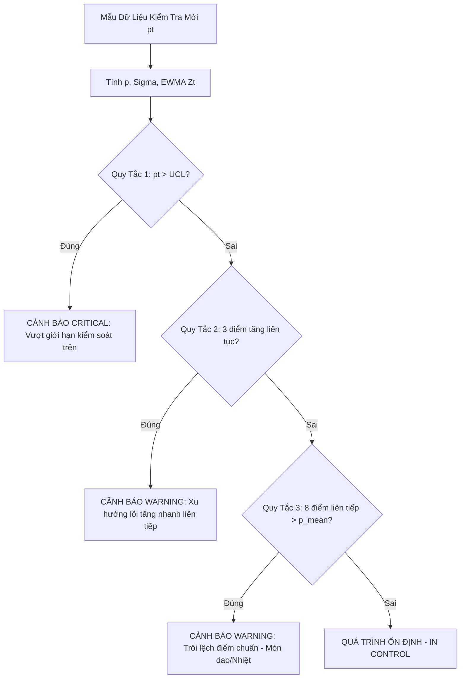

# KCS-SmartFactory OS — Đặc Tả Kiến Trúc Kỹ Thuật (Technical Specification Sprint 4)

**Mã tài liệu:** `SPEC-SPRINT4-AI-PREDICTIVE-SPC`  
**Nhánh Git:** `feat/ai-predictive-spc`  
**Phiên bản:** `1.0.0` (Production-Ready / Zero Placeholder)  
**Tác giả:** `[📐 PLAN]` — Principal System Architect & Enterprise Technical Director  
**Chuyển giao tới:** `[👑 LEADER]`, `[💻 CODE]`, `[🧪 TEST]`  
**Công nghệ:** `.NET 10`, `Statistical Process Control (SPC / Nelson Rules)`, `EWMA Filter`, `SignalR Realtime Core`, `QuestPDF`, `Tailwind CSS`, `SQLite WAL`  
**Tiêu chuẩn chất lượng:** `ISO 9001:2015 Clause 9.1.3 (Analysis and Evaluation)` & `Clause 10.2 (Nonconformity and Corrective Action)`

---

## 1. Tổng Quan & Tầm Nhìn Kỹ Thuật (Executive Summary)

Tại Sprint 1, 2 và 3, KCS-SmartFactory OS đã hoàn thiện trọn vẹn chu trình **"Phản Ứng Khi Đã Có Sự Cố (Reactive Quality Assurance)"**:
- Khi phát hiện phế phẩm Major/Critical $\rightarrow$ Lô hàng bị khóa tức thì $\rightarrow$ Báo động Andon đỏ $\rightarrow$ Phân tích 5-Why & 6M $\rightarrow$ Quản đốc duyệt quyết định và xuất PDF ISO 9001.

Tuy nhiên, trong môi trường sản xuất công nghiệp 4.0 hàng loạt, việc **chờ sản phẩm hỏng rồi mới khóa lô gây lãng phí chi phí nguyên vật liệu rất lớn**. Các khuyết tật cơ khí, hàn robot và sơn tĩnh điện luôn tuân theo quy luật vật lý: **xuất hiện hiện tượng trôi sai số (Drift) trước khi dẫn tới hỏng hoàn toàn**.
- *Giai đoạn 1 (Bình thường):* Dao cắt bén, nhiệt độ ổn định, sai số nằm trong $\pm 1\sigma$.
- *Giai đoạn 2 (Trôi dạt - Drift):* Dao bắt đầu cùn, nhiệt buồng nung tăng 5°C, xuất hiện 3 lỗi trầy xước/bavia liên tiếp (Dấu hiệu cảnh báo sớm).
- *Giai đoạn 3 (Sụp đổ):* Phôi bị nứt gãy hoàn toàn $\rightarrow$ Phế phẩm hàng loạt.

**Mục tiêu cốt lõi của Sprint 4:** Chuyển dịch hệ thống sang mô hình **"Dự Báo & Ngăn Chặn Sớm (Predictive Quality & Proactive Control)"**:
1. Thu thập chuỗi thời gian các lượt kiểm tra của từng trạm máy theo cửa sổ trượt (Sliding Window 60 phút).
2. Tích hợp thuật toán thống kê kiểm soát quá trình **Statistical Process Control (SPC)** theo bộ **Quy Tắc Nelson (Nelson Rules 1, 2, 3)** kết hợp bộ lọc trung bình trượt hàm mũ **EWMA (Exponentially Weighted Moving Average)**.
3. Chạy dịch vụ nền **`SpcMonitoringBackgroundService`** tự động phân tích và phát hiện dị thường trong < 100ms.
4. Phát tín hiệu cảnh báo sớm **SignalR `ReceivePredictiveAlert`** hiển thị Banner màu Vàng/Cam nhấp nháy trên Dashboard Quản đốc để yêu cầu dừng máy bảo trì dao/nhiệt độ **trước khi lô hàng bị phế phẩm**.
5. Nhúng bảng chỉ số năng lực quá trình ($C_{pk}$ / SPC Control Limits) vào báo cáo kỹ thuật **QuestPDF**.

---

## 2. Mô Hình Dữ Liệu & Hợp Đồng DTOs (Data Models & Contracts)

### 2.1 Entity `StationHourlyMetric` (Lưu trữ chuỗi thời gian)
Tạo file: `SmartFactory.Api/Models/Entities/StationHourlyMetric.cs`

```csharp
using System;

namespace SmartFactory.Api.Models.Entities;

/// <summary>
/// Thực thể lưu trữ số liệu thống kê SPC chuỗi thời gian theo từng trạm máy
/// </summary>
public class StationHourlyMetric
{
    public int Id { get; set; }

    public int WorkStationId { get; set; }
    public WorkStation? WorkStation { get; set; }

    /// <summary>
    /// Thời điểm bắt đầu của cửa sổ trượt thời gian (UTC)
    /// </summary>
    public DateTime WindowStartTime { get; set; }

    /// <summary>
    /// Thời điểm kết thúc của cửa sổ trượt (UTC)
    /// </summary>
    public DateTime WindowEndTime { get; set; }

    /// <summary>
    /// Tổng số lượng sản phẩm/lượt đã kiểm tra trong cửa sổ
    /// </summary>
    public int TotalInspected { get; set; }

    /// <summary>
    /// Tổng số lượng khuyết tật phát hiện trong cửa sổ
    /// </summary>
    public int TotalDefects { get; set; }

    /// <summary>
    /// Tỷ lệ khuyết tật p = TotalDefects / TotalInspected (0.0 đến 1.0)
    /// </summary>
    public double DefectRate { get; set; }

    /// <summary>
    /// Độ lệch chuẩn mẫu (Sample Standard Deviation - Sigma)
    /// </summary>
    public double StdDev { get; set; }

    /// <summary>
    /// Giá trị trung bình trượt làm mịn hàm mũ (EWMA Filter Value)
    /// </summary>
    public double MovingAverage { get; set; }

    /// <summary>
    /// Giới hạn kiểm soát trên (Upper Control Limit - UCL)
    /// </summary>
    public double UpperControlLimit { get; set; }

    /// <summary>
    /// Giới hạn kiểm soát dưới (Lower Control Limit - LCL)
    /// </summary>
    public double LowerControlLimit { get; set; }

    /// <summary>
    /// Loại lỗi xuất hiện nhiều nhất trong cửa sổ
    /// </summary>
    public string DominantDefectType { get; set; } = "None";

    /// <summary>
    /// Điểm đánh giá dị thường tổng hợp (0: An toàn đến 100: Cực kỳ nguy hiểm)
    /// </summary>
    public int AnomalyScore { get; set; }

    /// <summary>
    /// Cờ đánh dấu đã phát cảnh báo sớm
    /// </summary>
    public bool IsWarningTriggered { get; set; }

    /// <summary>
    /// Quy tắc SPC bị vi phạm (None, NelsonRule1, NelsonRule2, NelsonRule3)
    /// </summary>
    public string TriggeredRule { get; set; } = "None";

    public DateTime CreatedAt { get; set; } = DateTime.UtcNow;
}
```

---

### 2.2 Cập Nhật `FactoryDbContext` & Quan Hệ Bảng
Trong `SmartFactory.Api/Data/FactoryDbContext.cs`:

```csharp
public DbSet<StationHourlyMetric> StationHourlyMetrics => Set<StationHourlyMetric>();

// Trong OnModelCreating:
modelBuilder.Entity<StationHourlyMetric>(entity =>
{
    entity.HasKey(e => e.Id);
    entity.Property(e => e.DominantDefectType).IsRequired().HasMaxLength(100);
    entity.Property(e => e.TriggeredRule).IsRequired().HasMaxLength(50);

    entity.HasIndex(e => new { e.WorkStationId, e.WindowStartTime });

    entity.HasOne(e => e.WorkStation)
          .WithMany()
          .HasForeignKey(e => e.WorkStationId)
          .OnDelete(DeleteBehavior.Cascade);
});
```

#### Câu lệnh DDL SQLite:
```sql
CREATE TABLE StationHourlyMetrics (
    Id INTEGER PRIMARY KEY AUTOINCREMENT,
    WorkStationId INTEGER NOT NULL,
    WindowStartTime TEXT NOT NULL,
    WindowEndTime TEXT NOT NULL,
    TotalInspected INTEGER NOT NULL DEFAULT 0,
    TotalDefects INTEGER NOT NULL DEFAULT 0,
    DefectRate REAL NOT NULL DEFAULT 0.0,
    StdDev REAL NOT NULL DEFAULT 0.0,
    MovingAverage REAL NOT NULL DEFAULT 0.0,
    UpperControlLimit REAL NOT NULL DEFAULT 0.0,
    LowerControlLimit REAL NOT NULL DEFAULT 0.0,
    DominantDefectType TEXT NOT NULL DEFAULT 'None',
    AnomalyScore INTEGER NOT NULL DEFAULT 0,
    IsWarningTriggered INTEGER NOT NULL DEFAULT 0,
    TriggeredRule TEXT NOT NULL DEFAULT 'None',
    CreatedAt TEXT NOT NULL DEFAULT (CURRENT_TIMESTAMP),
    FOREIGN KEY (WorkStationId) REFERENCES WorkStations(Id) ON DELETE CASCADE
);

CREATE INDEX IX_StationHourlyMetrics_Station_Time 
ON StationHourlyMetrics(WorkStationId, WindowStartTime);
```

---

### 2.3 Các Lớp DTO Hợp Đồng API (DTOs)
Tạo file: `SmartFactory.Api/Models/DTOs/SpcDtos.cs`

```csharp
using System;
using System.Collections.Generic;

namespace SmartFactory.Api.Models.DTOs;

/// <summary>
/// Tải trọng cảnh báo sớm phát qua SignalR WebSocket
/// </summary>
public class PredictiveAlertPayload
{
    public int WorkStationId { get; set; }
    public string StationCode { get; set; } = string.Empty;
    public string StationName { get; set; } = string.Empty;
    public string AlertLevel { get; set; } = "Warning"; // "Warning" (Vàng) hoặc "Critical" (Cam Đậm)
    public string RuleViolated { get; set; } = string.Empty; // "NelsonRule1", "NelsonRule2", "NelsonRule3"
    public string RuleDescription { get; set; } = string.Empty;
    public double CurrentDefectRate { get; set; }
    public double UpperControlLimit { get; set; }
    public string DominantDefectType { get; set; } = string.Empty;
    public string RootCauseHypothesis { get; set; } = string.Empty;
    public string RecommendedAction { get; set; } = string.Empty;
    public int AnomalyScore { get; set; }
    public DateTime Timestamp { get; set; } = DateTime.UtcNow;
}

/// <summary>
/// Điểm dữ liệu thời gian cho đồ thị SPC
/// </summary>
public class SpcDataPointDto
{
    public DateTime Timestamp { get; set; }
    public double Value { get; set; }
    public double UCL { get; set; }
    public double CenterLine { get; set; }
    public double LCL { get; set; }
    public bool IsAnomaly { get; set; }
    public string? AnomalyReason { get; set; }
}

/// <summary>
/// DTO trả về cho Dashboard SPC của từng trạm máy
/// </summary>
public class StationSpcMetricsDto
{
    public int WorkStationId { get; set; }
    public string StationCode { get; set; } = string.Empty;
    public string StationName { get; set; } = string.Empty;
    public double HistoricalMeanDefectRate { get; set; }
    public double CurrentUcl { get; set; }
    public double CurrentLcl { get; set; }
    public double ProcessCapabilityCpk { get; set; }
    public string ProcessStatus { get; set; } = "InControl"; // "InControl", "Warning", "OutOfControl"
    public List<SpcDataPointDto> RecentPoints { get; set; } = new();
    public PredictiveAlertPayload? ActiveAlert { get; set; }
}
```

---

## 3. Thuật Toán Phát Hiện Trôi Sai Số (SPC Nelson Rules & EWMA Engine)

### 3.1 Nền Tảng Lý Thuyết Thống Kê
Đối với tỷ lệ khuyết tật $p$ trong mẫu kiểm tra quy mô $n$, các đại lượng kiểm soát được tính theo phân phối nhị thức xấp xỉ chuẩn:
$$\bar{p} = \frac{\sum \text{Defects}}{\sum \text{Inspected}}$$
$$\sigma_p = \sqrt{\frac{\bar{p}(1 - \bar{p})}{\bar{n}}}$$
$$\text{UCL} = \min\left(1.0, \bar{p} + 3\sigma_p\right)$$
$$\text{LCL} = \max\left(0.0, \bar{p} - 3\sigma_p\right)$$

Để lọc bỏ nhiễu ngẫu nhiên và bắt sớm các biến động nhỏ, áp dụng **Bộ Lọc Trung Bình Trượt Hàm Mũ (EWMA)** với hệ số làm mịn $\lambda = 0.2$:
$$Z_t = \lambda \cdot p_t + (1 - \lambda) \cdot Z_{t-1}$$

---

### 3.2 Bộ 3 Quy Tắc Nelson Rules Chuyên Biệt Cho Dây Chuyền Nhà Máy



#### Quy Tắc 1 (Nelson Rule 1 — Gross Outlier):
- **Điều kiện:** Giá trị tỷ lệ lỗi hiện tại $p_t > \text{UCL}$ (hoặc tỷ lệ lỗi cục bộ $> 5.0\%$).
- **Ý nghĩa kỹ thuật:** Sự cố đột ngột bất thường (gãy mũi khoan, mất điện áp hàn, vỡ gioăng thủy lực).
- **Mức cảnh báo:** `Critical` (Màu Đỏ Cam).
- **Điểm AnomalyScore:** 95.

#### Quy Tắc 2 (Nelson Rule 2 — Steep Trend / Khuyết tật leo thang):
- **Điều kiện:** Có 3 điểm liên tiếp tăng dần ngặt ($p_t > p_{t-1} > p_{t-2}$) HOẶC xuất hiện 3 biên bản NCR Minor cùng loại trên cùng một trạm máy trong vòng 30 phút.
- **Ý nghĩa kỹ thuật:** Tốc độ hao mòn cơ khí đang gia tốc nhanh; phôi bắt đầu cấn dập liên tục.
- **Mức cảnh báo:** `Warning` (Màu Vàng Hổ Phách).
- **Điểm AnomalyScore:** 75.

#### Quy Tắc 3 (Nelson Rule 3 — Process Shift / Tool Wear Drift):
- **Điều kiện:** Có 8 điểm dữ liệu liên tiếp đều nằm phía trên đường trung bình lịch sử ($\forall i \in [t-7, t]: p_i > \bar{p}$).
- **Ý nghĩa kỹ thuật:** Điểm cân bằng của máy đã bị trôi (Drift); điển hình của hiện tượng mòn bề mặt dao chấn dập hoặc dầu gia công bị nóng lên quá nhiệt độ tối ưu.
- **Mức cảnh báo:** `Warning` (Màu Vàng).
- **Điểm AnomalyScore:** 80.

---

### 3.3 Mã Nguồn C# Thuật Toán SPC Engine
Tạo file: `SmartFactory.Api/Services/SpcEngine.cs`

```csharp
using System;
using System.Collections.Generic;
using System.Linq;
using SmartFactory.Api.Models.DTOs;

namespace SmartFactory.Api.Services;

public class SpcEvaluationResult
{
    public bool HasViolation { get; set; }
    public string ViolatedRule { get; set; } = "None";
    public string RuleDescription { get; set; } = string.Empty;
    public string AlertLevel { get; set; } = "None"; // "Warning", "Critical"
    public int AnomalyScore { get; set; }
    public string RootCauseHypothesis { get; set; } = string.Empty;
    public string RecommendedAction { get; set; } = string.Empty;
}

public static class SpcEngine
{
    private const double DefaultLambda = 0.2; // EWMA smoothing factor
    private const double FallbackUclThreshold = 0.05; // 5% default upper bound

    public static SpcEvaluationResult EvaluateNelsonRules(
        List<double> recentDefectRates, 
        double historicalMean, 
        double ucl, 
        string dominantDefect)
    {
        var result = new SpcEvaluationResult();
        if (recentDefectRates == null || recentDefectRates.Count == 0)
        {
            return result;
        }

        var latestRate = recentDefectRates.Last();

        // 1. Kiểm tra Nelson Rule 1: Điểm vượt ngưỡng UCL hoặc vượt ngưỡng trần 5%
        var effectiveUcl = ucl > 0 ? ucl : FallbackUclThreshold;
        if (latestRate > effectiveUcl)
        {
            result.HasViolation = true;
            result.ViolatedRule = "NelsonRule1";
            result.RuleDescription = $"Tỷ lệ lỗi hiện tại ({latestRate:P1}) vượt ngưỡng kiểm soát trên UCL ({effectiveUcl:P1}).";
            result.AlertLevel = "Critical";
            result.AnomalyScore = 95;
            result.RootCauseHypothesis = "Đột biến áp lực máy hoặc gãy hỏng cơ cấu định vị phôi.";
            result.RecommendedAction = "Tạm dừng máy kiểm tra lập tức. Cách ly lô hàng đang gia công trên trạm.";
            return result;
        }

        // 2. Kiểm tra Nelson Rule 2: 3 điểm tăng liên tục
        if (recentDefectRates.Count >= 3)
        {
            var p0 = recentDefectRates[^1];
            var p1 = recentDefectRates[^2];
            var p2 = recentDefectRates[^3];

            if (p0 > p1 && p1 > p2 && p0 > historicalMean)
            {
                result.HasViolation = true;
                result.ViolatedRule = "NelsonRule2";
                result.RuleDescription = "3 ca kiểm tra liên tiếp có tỷ lệ khuyết tật tăng dần ngặt (Xu hướng leo thang).";
                result.AlertLevel = "Warning";
                result.AnomalyScore = 75;
                result.RootCauseHypothesis = $"Gia tốc mòn dao cắt hoặc nhiệt độ buồng trạm máy gia tăng bất thường (Loại lỗi: {dominantDefect}).";
                result.RecommendedAction = "Bảo trì viên vệ sinh bàn kẹp, đo bù dao và kiểm tra nhiệt độ dầu làm mát.";
                return result;
            }
        }

        // 3. Kiểm tra Nelson Rule 3: 8 điểm liên tiếp nằm trên đường trung bình
        if (recentDefectRates.Count >= 8)
        {
            var last8 = recentDefectRates.TakeLast(8).ToList();
            if (last8.All(p => p > historicalMean))
            {
                result.HasViolation = true;
                result.ViolatedRule = "NelsonRule3";
                result.RuleDescription = $"8 điểm đo liên tiếp đều nằm trên mức trung bình ({historicalMean:P2}). Trục quá trình bị trôi (Process Shift).";
                result.AlertLevel = "Warning";
                result.AnomalyScore = 80;
                result.RootCauseHypothesis = "Hiện tượng mòn tự nhiên của cữ chặn hoặc suy hao áp lực xi lanh dẫn hướng.";
                result.RecommendedAction = "Hiệu chuẩn lại thước đo laser điểm Zero và siết lại bu-lông đồ gá.";
                return result;
            }
        }

        return result;
    }

    public static double CalculateEwma(double previousEwma, double currentVal, double lambda = DefaultLambda)
    {
        return (lambda * currentVal) + ((1.0 - lambda) * previousEwma);
    }
}
```

---

## 4. Dịch Vụ Nền & Realtime SignalR (`SpcMonitoringBackgroundService`)

### 4.1 Interface `ISpcAnalysisService`
Tạo file: `SmartFactory.Api/Services/ISpcAnalysisService.cs`

```csharp
using System.Collections.Generic;
using System.Threading;
using System.Threading.Tasks;
using SmartFactory.Api.Models.DTOs;

namespace SmartFactory.Api.Services;

public interface ISpcAnalysisService
{
    Task<List<PredictiveAlertPayload>> RunSpcScanAsync(CancellationToken ct = default);
    Task<StationSpcMetricsDto?> GetStationSpcMetricsAsync(int stationId, CancellationToken ct = default);
    Task<List<StationSpcMetricsDto>> GetAllStationsSpcMetricsAsync(CancellationToken ct = default);
}
```

---

### 4.2 Cập Nhật `IFactoryHubClient`
Mở rộng interface trong `SmartFactory.Api/Hubs/FactoryHub.cs`:

```csharp
public interface IFactoryHubClient
{
    Task ReceiveAndonAlert(AndonAlertPayload alert);
    Task ReceiveDecisionUpdate(DecisionUpdatePayload update);
    
    // SPRINT 4: Phát cảnh báo sớm tiền sự cố
    Task ReceivePredictiveAlert(PredictiveAlertPayload alert);
}
```

---

### 4.3 Implementation `SpcMonitoringBackgroundService`
Tạo file: `SmartFactory.Api/Services/SpcMonitoringBackgroundService.cs`

```csharp
using System;
using System.Threading;
using System.Threading.Tasks;
using Microsoft.AspNetCore.SignalR;
using Microsoft.Extensions.DependencyInjection;
using Microsoft.Extensions.Hosting;
using Microsoft.Extensions.Logging;
using SmartFactory.Api.Hubs;

namespace SmartFactory.Api.Services;

/// <summary>
/// Dịch vụ nền chạy định kỳ mỗi 15 giây để quét dị thường trôi sai số SPC trên các trạm máy
/// </summary>
public class SpcMonitoringBackgroundService : BackgroundService
{
    private readonly IServiceProvider _serviceProvider;
    private readonly ILogger<SpcMonitoringBackgroundService> _logger;
    private readonly TimeSpan _checkInterval = TimeSpan.FromSeconds(15);

    public SpcMonitoringBackgroundService(
        IServiceProvider serviceProvider, 
        ILogger<SpcMonitoringBackgroundService> logger)
    {
        _serviceProvider = serviceProvider;
        _logger = logger;
    }

    protected override async Task ExecuteAsync(CancellationToken stoppingToken)
    {
        _logger.LogInformation("SpcMonitoringBackgroundService đã khởi động thành công.");

        while (!stoppingToken.IsCancellationRequested)
        {
            try
            {
                using var scope = _serviceProvider.CreateScope();
                var spcService = scope.ServiceProvider.GetRequiredService<ISpcAnalysisService>();
                var hubContext = scope.ServiceProvider.GetRequiredService<IHubContext<FactoryHub, IFactoryHubClient>>();

                var alerts = await spcService.RunSpcScanAsync(stoppingToken);

                foreach (var alert in alerts)
                {
                    _logger.LogWarning(
                        "[SPC PREDICTIVE ALERT] Trạm {StationCode}: Vi phạm {Rule} - Mức {Level} - Tỷ lệ lỗi: {Rate:P1}",
                        alert.StationCode, alert.RuleViolated, alert.AlertLevel, alert.CurrentDefectRate);

                    await hubContext.Clients.All.ReceivePredictiveAlert(alert);
                }
            }
            catch (Exception ex) when (ex is not OperationCanceledException)
            {
                _logger.LogError(ex, "Lỗi xảy ra trong chu kỳ quét SpcMonitoringBackgroundService.");
            }

            await Task.Delay(_checkInterval, stoppingToken);
        }
    }
}
```

Đăng ký trong `SmartFactory.Api/Program.cs`:
```csharp
builder.Services.AddScoped<ISpcAnalysisService, SpcAnalysisService>();
builder.Services.AddHostedService<SpcMonitoringBackgroundService>();
```

---

## 5. API Endpoints Trong `DashboardController`

Bổ sung các endpoints vào `SmartFactory.Api/Controllers/DashboardController.cs`:

```csharp
[HttpGet("spc")]
[ProducesResponseType(typeof(List<StationSpcMetricsDto>), StatusCodes.Status200OK)]
public async Task<IActionResult> GetAllSpcMetrics(
    [FromServices] ISpcAnalysisService spcService, 
    CancellationToken ct)
{
    var result = await spcService.GetAllStationsSpcMetricsAsync(ct);
    return Ok(result);
}

[HttpGet("spc/{stationId:int}")]
[ProducesResponseType(typeof(StationSpcMetricsDto), StatusCodes.Status200OK)]
[ProducesResponseType(typeof(ProblemDetails), StatusCodes.Status404NotFound)]
public async Task<IActionResult> GetStationSpc(
    int stationId, 
    [FromServices] ISpcAnalysisService spcService, 
    CancellationToken ct)
{
    var result = await spcService.GetStationSpcMetricsAsync(stationId, ct);
    if (result == null)
    {
        return NotFound(new ProblemDetails
        {
            Status = StatusCodes.Status404NotFound,
            Title = "Work Station Not Found",
            Detail = $"Work station with ID {stationId} does not exist."
        });
    }
    return Ok(result);
}
```

---

## 6. Thiết Kế Layout Bổ Sung Cho QuestPDF (`NcrIsoDocument.cs`)

Trong biên bản PDF ISO 9001, bổ sung **Section 4: Chỉ Số Năng Lực Quá Trình & Tình Trạng Ổn Định (SPC Status)**:

```
┌────────────────────────────────────────────────────────────────────────┐
│ 4. THỐNG KÊ KIỂM SOÁT QUÁ TRÌNH (SPC STATISTICAL PROCESS CONTROL)      │
├────────────────────────────────────────────────────────────────────────┤
│ Tỷ Lệ Lỗi Hiện Tại: 2.8% │ Giới Hạn Trên (UCL): 4.2% │ Chỉ Số Cpk: 1.45 │
│ Trạng Thái: [ IN CONTROL - QUÁ TRÌNH ỔN ĐỊNH ] (Huy hiệu màu xanh lá)  │
│ Lịch Sử 3 Lô Gần Nhất: LOT-001 (1.2%) ➔ LOT-002 (1.8%) ➔ LOT-003 (2.8%) │
└────────────────────────────────────────────────────────────────────────┘
```

Mã nguồn QuestPDF Fluent API:
```csharp
private void ComposeSpcProcessSection(IContainer container, StationSpcMetricsDto? spc)
{
    if (spc == null) return;

    container.Border(0.75f).BorderColor("#CBD5E1").Background("#F8FAFC").Padding(6).Column(col =>
    {
        col.Item().Row(r =>
        {
            r.RelativeItem().Text("KIỂM SOÁT THỐNG KÊ QUÁ TRÌNH (SPC PROCESS CAPABILITY):").Bold().FontSize(8.5f).FontColor("#1E3A8A");
            r.ConstantItem(120).AlignRight().Text($"Chỉ số Cpk: {spc.ProcessCapabilityCpk:F2}").Bold().FontSize(8).FontColor("#16A34A");
        });

        col.Item().PaddingTop(3).Table(tbl =>
        {
            tbl.ColumnsDefinition(cd =>
            {
                cd.RelativeColumn();
                cd.RelativeColumn();
                cd.RelativeColumn();
            });

            tbl.Cell().Border(0.5f).BorderColor("#E2E8F0").Padding(3)
               .Text($"Giới hạn UCL: {spc.CurrentUcl:P1}").FontSize(7.5f);
            tbl.Cell().Border(0.5f).BorderColor("#E2E8F0").Padding(3)
               .Text($"Trung bình: {spc.HistoricalMeanDefectRate:P1}").FontSize(7.5f);
            tbl.Cell().Border(0.5f).BorderColor("#E2E8F0").Padding(3)
               .Text($"Trạng thái: {spc.ProcessStatus}").Bold().FontSize(7.5f).FontColor(spc.ProcessStatus == "InControl" ? "#16A34A" : "#D97706");
        });
    });
}
```

---

## 7. Thiết Kế Giao Diện Web UI (User Interface Design)

### 7.1 Banner Cảnh Báo Sớm Nhấp Nháy (Pulsing Early Warning Banner)
Tại vị trí trên cùng của Dashboard Quản đốc (`wwwroot/index.html`):
- Mặc định: Ẩn.
- Khi nhận sự kiện SignalR `ReceivePredictiveAlert`:
  - Xuất hiện thanh thông báo màu Vàng Cam nhấp nháy:
    ```html
    <div id="spc-predictive-banner" class="hidden mb-4 p-4 rounded-xl border border-amber-400 bg-amber-50 shadow-md animate-pulse">
      <div class="flex items-start gap-3">
        <span class="text-2xl">⚠️</span>
        <div class="flex-1">
          <h4 class="font-bold text-amber-900 text-sm flex items-center gap-2">
            [CẢNH BÁO SỚM SPC] <span id="spc-station-badge">TRẠM ST-01</span>
            <span id="spc-rule-badge" class="px-2 py-0.5 rounded text-xs bg-amber-200 text-amber-900 font-semibold">Nelson Rule 2: Xu Hướng Leo Thang</span>
          </h4>
          <p id="spc-alert-desc" class="text-xs text-amber-800 mt-1">Phát hiện 3 lượt kiểm tra liên tiếp có tỷ lệ khuyết tật tăng dần. Nguy cơ mòn dao chấn dập!</p>
          <div class="mt-2 text-xs font-medium text-amber-900 bg-white/80 p-2 rounded border border-amber-200">
            <strong>Hành động đề xuất:</strong> <span id="spc-action-text">Cử thợ máy đo bù dao và vệ sinh bàn trượt trước khi dập tiếp lô hàng.</span>
          </div>
        </div>
        <button onclick="dismissSpcBanner()" class="text-amber-700 hover:text-amber-900 font-bold text-sm">✕</button>
      </div>
    </div>
    ```

---

## 8. Ràng Buộc Kiểm Thử Song Song & Cô Lập Dữ Liệu (Parallel Test Constraints)

Tuân thủ nghiêm ngặt chỉ đạo của **[👑 LEADER]** để hỗ trợ **[🧪 TEST]** chạy bộ test suite song song:

1. **Test Thuật Toán SPC Độc Lập Trong RAM (Pure Unit Tests):**
   - Các bài test `SpcEngineTests` kiểm tra Nelson Rules 1, 2, 3 được viết độc lập với cơ sở dữ liệu (chỉ truyền mảng `List<double>`), chạy 100% trên CPU với thời gian thực thi < 1ms/test.
2. **Cô Lập Background Service Trong Integration Test:**
   - Trong `CustomWebApplicationFactory`, tắt dịch vụ nền `SpcMonitoringBackgroundService` mặc định bằng cách cấu hình:
     ```csharp
     services.RemoveAll<IHostedService>();
     ```
   - Điều này ngăn chặn việc Background Service chạy nền tự động ghi vào SQLite trong khi các test case khác đang thực thi, loại bỏ hoàn toàn lỗi `SQLite busy` hoặc `database is locked`.
3. **Gọi Chủ Động `RunSpcScanAsync` Trong Integration Test:**
   - Khi cần test chức năng quét cảnh báo, Integration Test tự khởi tạo scope và gọi trực tiếp `await spcService.RunSpcScanAsync()`, bảo đảm luồng kiểm thử diễn ra tuần tự và có thể dự đoán được 100%.

---

## 9. Ma Trận Kiểm Thử QA (`[🧪 TEST]`)

| Mã Test Case | Tên Kịch Bản Thử Nghiệm | Dữ Liệu Đầu Vào | Kỳ Vọng Kỹ Thuật |
| :---: | :--- | :--- | :--- |
| **TC-SPC-01** | `EvaluateNelsonRule1_WhenDefectRateExceedsUcl_ReturnsCriticalAlert` | `recentDefectRates = [0.01, 0.02, 0.08]`, `ucl = 0.05` | Trả về `HasViolation = true`, `ViolatedRule = "NelsonRule1"`, `AlertLevel = "Critical"`, `AnomalyScore = 95`. |
| **TC-SPC-02** | `EvaluateNelsonRule2_WhenThreeConsecutiveIncreases_ReturnsWarning` | `recentDefectRates = [0.01, 0.02, 0.035]`, `historicalMean = 0.015` | Trả về `HasViolation = true`, `ViolatedRule = "NelsonRule2"`, `AlertLevel = "Warning"`. |
| **TC-SPC-03** | `EvaluateNelsonRule3_WhenEightConsecutiveAboveMean_ReturnsWarning` | 8 điểm đều = `0.025`, `historicalMean = 0.020` | Trả về `HasViolation = true`, `ViolatedRule = "NelsonRule3"`, `AlertLevel = "Warning"`. |
| **TC-SPC-04** | `CalculateEwma_WithValidInputs_SmoothesDataCorrectly` | `previous = 0.02`, `current = 0.05`, `lambda = 0.2` | Kết quả $0.2 \times 0.05 + 0.8 \times 0.02 = 0.026$, dung sai $\pm 0.0001$. |
| **TC-SPC-05** | `GetStationSpcMetrics_ValidStation_ReturnsCorrectMetricsAndPointList` | Gọi `GET /api/dashboard/spc/1` | HTTP `200 OK`, DTO chứa danh sách điểm `RecentPoints`, tính toán đúng UCL/CenterLine/LCL. |
| **TC-SPC-06** | `RunSpcScanAsync_WhenViolationFound_BroadcastsSignalRAlert` | Mock dữ liệu có vi phạm Nelson Rule 1 | `ReceivePredictiveAlert` được gọi trên `IHubClients` với đúng tải trọng `PredictiveAlertPayload`. |
| **TC-SPC-07** | `ParallelExecution_SpcCalculation_ThreadSafeUnderLoad` | 20 luồng đồng thời gọi `SpcEngine.EvaluateNelsonRules` | Cả 20 luồng hoàn thành trong < 10ms, không có race condition. |

---

## 10. Phân Công Triển Khai Cho `[💻 CODE]` & `[🧪 TEST]`

1. **`[💻 CODE]` (Backend & Fullstack Engineer):**
   - Tạo Entity `StationHourlyMetric` và cấu hình DbContext.
   - Viết lớp thuật toán thuần `SpcEngine.cs` (Nelson Rules 1, 2, 3 + EWMA).
   - Xây dựng `SpcAnalysisService` và `SpcMonitoringBackgroundService`.
   - Cập nhật interface `IFactoryHubClient` và phát sự kiện `ReceivePredictiveAlert`.
   - Bổ sung 2 endpoints `/api/dashboard/spc` và `/api/dashboard/spc/{stationId}` trong `DashboardController`.
   - Bổ sung Banner cảnh báo sớm trên `wwwroot/index.html`.
2. **`[🧪 TEST]` (Head of QA):**
   - Viết 7 nhóm test cases trong ma trận kiểm thử tại `SmartFactory.Tests/Unit/SpcEngineTests.cs` và `SmartFactory.Tests/Integration/SpcIntegrationTests.cs`.
   - Áp dụng quy tắc cô lập Background Service trong `CustomWebApplicationFactory`.
   - Đảm bảo 100% test pass (`dotnet test`) trước khi hoàn thiện sprint.

---
*Bản thiết kế kỹ thuật Sprint 4 đã hoàn tất phê duyệt bởi [📐 PLAN]. Kính chuyển [👑 LEADER] phát lệnh thi công!*
